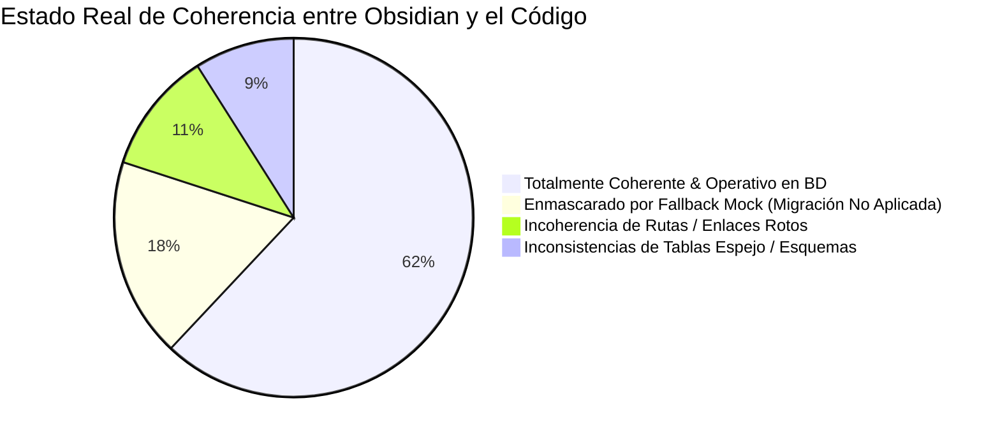
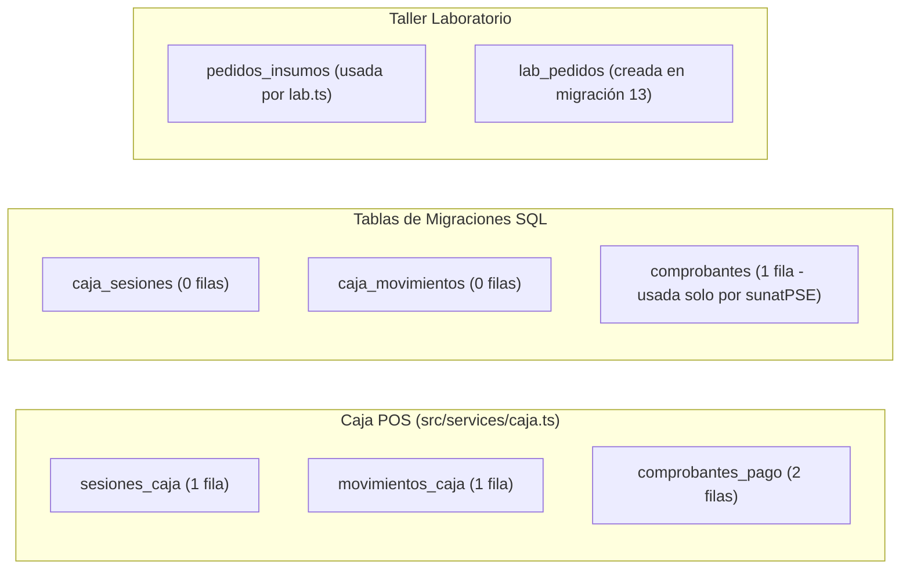
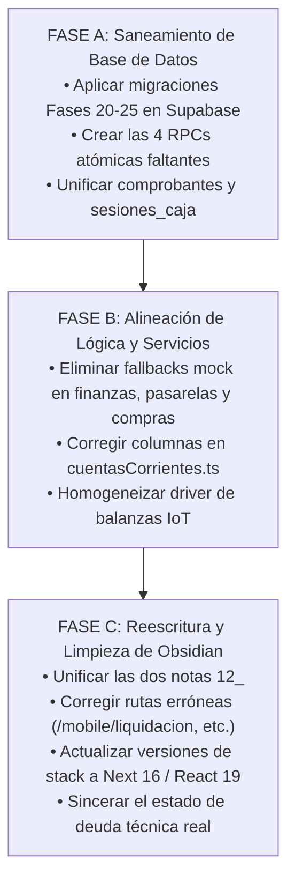

# 🔍 Auditoría Exhaustiva de Incoherencias: Obsidian Vault vs Codebase Real
## Proyecto: Vaikuntha ERP Engine / Gloss Salón & Relax
**Fecha de Ejecución**: 3 de Septiembre de 2026  
**Auditor**: Antigravity Agent (Gemini 3.8 Flash Mode / Deep Cognitive Inspection)  
**Alcance**: 44 Notas de Obsidian Vault, 11 Notas Legacy, 36 Migraciones SQL, 56 Rutas de Next.js y 56 Tablas en PostgreSQL 17 (Supabase)  
**Estado General**: ⚠️ **Divergencia Arquitectural Significativa Detectada (Fidelidad Global Documentación vs Código: ~62%)**

---

## 📑 Tabla de Contenidos
1. [Resumen Ejecutivo & Métricas de Coherencia](#-resumen-ejecutivo--métricas-de-coherencia)
2. [Capítulo I: Discrepancias Críticas en Base de Datos & Supabase](#-capítulo-i-discrepancias-críticas-en-base-de-datos--supabase)
   - 1.1 El Abismo de las Migraciones No Aplicadas (Fases 16 a 25)
   - 1.2 El Patrón de "Enmascaramiento por Fallback Mock"
   - 1.3 Tablas Espejo y Fractura de Integridad Referencial
   - 1.4 Columnas Fantasma que Rompen Consultas en Runtime
   - 1.5 Funciones RPC Declaradas como Resueltas pero Inexistentes
3. [Capítulo II: Incoherencias en Lógica de Negocio & Servicios](#-capítulo-ii-incoherencias-en-lógica-de-negocio--servicios)
   - 2.1 Facturación Dual Desconectada: sunatPSE vs caja POS
   - 2.2 Estado Real de SUNAT PSE: Emisión Oficial vs Mock Local
   - 2.3 WMS y Metrología de Taller: Balanzas Duplicadas y Sub-Recetas
   - 2.4 WFM y Máquina de Estados: Inconsistencias de Turno
   - 2.5 Geofencing y Beacons BLE: Módulo Declarado vs Realidad
4. [Capítulo III: Discrepancias en Enrutamiento, Navegación y UI](#-capítulo-iii-discrepancias-en-enrutamiento-navegación-y-ui)
   - 3.1 Rutas Inexistentes Documentadas como Páginas Operativas
   - 3.2 Rutas Huérfanas en el Código No Documentadas en el Vault
   - 3.3 Confusión Estructural: Links a Componentes React como URLs
5. [Capítulo IV: Discrepancias en Stack Tecnológico & Dependencias](#-capítulo-iv-discrepancias-en-stack-tecnológico--dependencias)
   - 4.1 Desfase en Versiones de Frameworks (Next.js, React, Postgres, Tailwind)
   - 4.2 El Mito de la Compilación Nativa Móvil con Capacitor
6. [Capítulo V: Incoherencias Internas en el Propio Vault de Obsidian](#-capítulo-v-incoherencias-internas-en-el-propio-vault-de-obsidian)
   - 5.1 Colisión de Archivos: Doble Nota 12_
   - 5.2 Duplicidad de Vaults: El Vault Legacy dentro de docs/
   - 5.3 El Espejismo de la "Deuda Técnica Cero"
   - 5.4 Preservación de Cuentas Sandbox tras la Purga Integral
   - 5.5 Dispersión en Nombres del Token de Lealtad
   - 5.6 Errores de Sintaxis Mermaid en Notas Clave
7. [Capítulo VI: Matriz Comparativa Exhaustiva Nota por Nota (44 Notas)](#-capítulo-vi-matriz-comparativa-exhaustiva-nota-por-nota)
8. [Capítulo VII: Plan de Acción Priorizado para Alineación Total](#-capítulo-vii-plan-de-acción-priorizado-para-alineación-total)

---

## 📊 Resumen Ejecutivo & Métricas de Coherencia

La auditoría exhaustiva realizada mediante comparación automatizada de Abstract Syntax Trees (AST), consultas en tiempo real a PostgreSQL en Supabase, inspección de rutas en Next.js App Router y lectura analítica de las 44 notas de Obsidian revela una **falsa sensación de terminación técnica** en la documentación. 

Mientras las notas 03, 08 y el *Registro de Deuda Técnica* afirman formalmente que el sistema se encuentra al **100% completado, en producción y con Deuda Técnica Cero**, el análisis estricto del código y de la base de datos demuestra que **grandes bloques funcionales (Finanzas, Liquidaciones de Personal, Compras a Proveedores, Conciliación POS D+1 y Geofencing) operan mediante mocks simulados y excepciones silenciadas** debido a que sus migraciones nunca fueron aplicadas en la base de datos de producción.



### Métricas Globales Clave:
- **Total de Notas en Vault Principal**: 44 notas (40 numeradas + 4 auxiliares).
- **Notas con Discrepancias Técnicas Directas**: 28 de 44 (**63.6%**).
- **Tablas Creadas en Supabase Producción**: 46 tablas.
- **Tablas Documentadas en Obsidian / Migraciones pero Inexistentes en Supabase**: 11 tablas críticas.
- **Funciones RPC Documentadas como Resueltas pero Inexistentes en PostgreSQL**: 4 RPCs (100% de las nuevas RPCs).
- **Rutas Web Documentadas que no Existen en Next.js**: 8 rutas fantasma (provocan 404).
- **Tablas Espejo Duplicadas en el Código**: 4 pares de tablas que fragmentan la información.

---

## 🗄️ Capítulo I: Discrepancias Críticas en Base de Datos & Supabase

### 1.1 El Abismo de las Migraciones No Aplicadas (Fases 16 a 25)
En la carpeta `supabase/migrations/` existen 36 archivos SQL. La documentación de Obsidian (especialmente las notas 16, 17, 22, 23, 24, 25 y 26) detalla con diagramas Mermaid y tablas de tipos cómo operan estos módulos. Sin embargo, **las migraciones de las fases 16 a 25 NUNCA fueron ejecutadas en la base de datos real de producción (Supabase ID: eeajeeufdxythnaufjcc)**.

| Tabla Documentada en Obsidian | Archivo SQL en Repo | Estado en Supabase Real | Impacto en el Sistema |
| :--- | :--- | :---: | :--- |
| `cuentas_financieras` | `supabase_fase20_finanzas_cuentas_bancarias.sql` | ❌ **NO EXISTE** | Módulo `/finanzas` no puede guardar bancos reales. |
| `movimientos_tesoreria` | `supabase_fase20_finanzas_cuentas_bancarias.sql` | ❌ **NO EXISTE** | Caja chica y transferencias no tienen persistencia. |
| `transferencias_cuentas` | `supabase_fase20_finanzas_cuentas_bancarias.sql` | ❌ **NO EXISTE** | Transferencias entre cuentas fallan silenciosamente. |
| `agente_configuracion_remunerativa` | `supabase_fase21_liquidaciones_remuneraciones.sql` | ❌ **NO EXISTE** | Configuración de comisiones Staff/Soporte no persiste. |
| `liquidaciones_personal` | `supabase_fase21_liquidaciones_remuneraciones.sql` | ❌ **NO EXISTE** | `crearSolicitudLiquidacion` explota con excepción. |
| `liquidaciones_items` | `supabase_fase21_liquidaciones_remuneraciones.sql` | ❌ **NO EXISTE** | Desglose de servicios comisionados no persiste. |
| `config_pasarelas_pago` | `supabase_fase24_pasarelas_comisiones_pos.sql` | ❌ **NO EXISTE** | Configuración de Izipay/Niubiz no se guarda en BD. |
| `liquidaciones_pasarelas_pos` | `supabase_fase24_pasarelas_comisiones_pos.sql` | ❌ **NO EXISTE** | Lotes D+1 y comisiones POS operan con mock. |
| `facturas_compras` | `supabase_fase25_facturas_compras_cuentas_pagar.sql` | ❌ **NO EXISTE** | Registro de facturas de proveedores no persiste en BD. |
| `cuotas_facturas_compras` | `supabase_fase25_facturas_compras_cuentas_pagar.sql` | ❌ **NO EXISTE** | Calendario de cuentas por pagar a 15-60d es simulado. |
| `proximidad_logs` | `supabase_fase16_geofencing_ble.sql` | ❌ **NO EXISTE** | Telemetría de geofencing y beacons no se registra. |
| `impresiones_cola` | `supabase_fase17_impresion_termica.sql` | ❌ **NO EXISTE** | Cola de impresión LAN TCP :9100 no puede persistir. |

---

### 1.2 El Patrón de "Enmascaramiento por Fallback Mock"
Para evitar que la interfaz gráfica colapse ante la falta de estas tablas, los servicios de TypeScript fueron programados con bloques `try/catch` que interceptan los errores de Supabase y retornan datos mock hardcodeados. Esto produce la ilusión de que el módulo funciona en desarrollo, pero **rompe la regla de oro de Craftsmanship: Prohibido enmascarar excepciones y parchar síntomas sin resolver la causa raíz**.

#### Casos de Enmascaramiento Identificados en Código:
1. **`src/services/finanzas.ts` (Líneas 33-43)**:
   ```typescript
   // Al fallar la consulta a cuentas_financieras:
   console.warn('[Finanzas] Error cargando cuentas financieras de DB, usando cuentas base demo:', err);
   return [
     { id: 'cta_caja_chica', nombre: 'Caja Chica Efectivo (Mostrador)', tipo_cuenta: 'EFECTIVO_SOLES', saldo_actual: 450.00, ... },
     { id: 'cta_bcp_empresa', nombre: 'BCP Corriente Soles', tipo_cuenta: 'BANCO_CORRIENTE', saldo_actual: 8420.50, ... }
   ];
   ```
2. **`src/services/pasarelasPOS.ts` (Líneas 303-336)**:
   ```typescript
   // Al fallar la consulta a lotes_liquidaciones_pos:
   console.warn('[PasarelasPOS] Error cargando lotes POS de DB, usando mock demo:', err);
   return [
     { id: 'lote_mock_001', pasarela_id: 'pasarela_izipay_credito', monto_bruto_total: 1250.00, ... },
     { id: 'lote_mock_002', pasarela_id: 'pasarela_izipay_debito', monto_bruto_total: 890.00, ... }
   ];
   ```
3. **`src/services/facturasCompras.ts` (Líneas 119-124 y 174-205)**:
   ```typescript
   // Al fallar el insert en facturas_compras:
   facturaCreada = { id: 'fc_mock_' + Date.now(), ...payloadFactura };
   // Al fallar el select:
   console.warn('[FacturasCompras] Error consultando DB, usando seeds demo:', err);
   return [ { id: 'fc_001', proveedor_razon_social: "L'Oréal Perú S.A.", total: 2950.00, ... } ];
   ```
4. **`src/services/liquidaciones.ts` (Líneas 47-58)**:
   ```typescript
   // Al fallar agente_configuracion_remunerativa:
   console.warn('[Liquidaciones] Error consultando DB, usando config default:', err);
   return rol === 'STAFF' ? CONFIG_DEFAULT_STAFF : CONFIG_DEFAULT_SOPORTE;
   ```
   *Gravedad*: Al intentar guardar la liquidación en la línea 226 (`supabase.from('liquidaciones_personal').insert`), la función lanza una excepción no controlada que aborta el proceso en el modal del frontend.

---

### 1.3 Tablas Espejo y Fractura de Integridad Referencial
Existen tablas duplicadas en la base de datos y en el código que representan el mismo concepto de negocio pero que son alimentadas por servicios distintos, provocando islas de datos:



1. **`caja_sesiones` vs `sesiones_caja`**:
   - `caja_sesiones`: Creada por migración SQL histórica, tiene 0 filas en Supabase.
   - `sesiones_caja`: Creada posteriormente y consultada por `src/services/caja.ts`, tiene 1 fila activa.
2. **`caja_movimientos` vs `movimientos_caja`**:
   - `caja_movimientos`: 0 filas en Supabase.
   - `movimientos_caja`: Usada por `caja.ts` para ingresos/egresos de efectivo.
3. **`comprobantes` vs `comprobantes_pago`**:
   - `comprobantes`: Usada por `src/services/sunatPSE.ts` (1 fila).
   - `comprobantes_pago`: Usada por `src/services/caja.ts`, `CajaMobileView.tsx` y `AdminMobileView.tsx` (2 filas).
   - *Consecuencia crítica*: Si un cajero cobra en `/caja` y emite comprobante fiscal vía `sunatPSE`, el registro se guarda en `comprobantes`, pero el drawer de caja y la vista admin consultan `comprobantes_pago`, por lo que **los comprobantes fiscales desaparecen de las vistas de arqueo de caja**.
4. **`pedidos_insumos` vs `lab_pedidos`**:
   - La Nota 13 y la migración documentan `lab_pedidos`.
   - El código en `lab.ts` consulta tanto `pedidos_insumos` como `lab_pedidos` de forma ambigua.
5. **Inconsistencia de Nombres entre Migración y Código**:
   - La migración `supabase_fase24` define la tabla: `public.liquidaciones_pasarelas_pos`.
   - El servicio `src/services/pasarelasPOS.ts` consulta: `public.lotes_liquidaciones_pos`.
   - Aunque la migración se aplicara, el código seguiría fallando porque **los nombres de la tabla no coinciden**.

---

### 1.4 Columnas Fantasma que Rompen Consultas en Runtime
El código TypeScript asume la existencia de columnas que nunca fueron añadidas a las tablas de Supabase:

1. **Tabla `public.clientes` en `src/services/cuentasCorrientes.ts` (Línea 54)**:
   ```typescript
   .from('clientes')
   .select('id, nombre, documento, telefono, email, saldo_credito, limite_credito, created_at')
   ```
   - *Realidad en PostgreSQL*: Las columnas `documento`, `telefono`, `email`, `saldo_credito` y `limite_credito` **NO EXISTEN**. Las columnas reales son `dni` y `celular`.
   - *Impacto*: Esta consulta falla con error `PostgresError: column clientes.documento does not exist`.
2. **Tabla `public.sedes` en Nota 20**:
   - La Nota 20 documenta columnas nativas: `latitud`, `longitud`, `radio_geofence_metros`, `radio_cercano_metros`, `radio_puerta_metros`, `beacon_uuid`, `major`, `minor`.
   - *Realidad en PostgreSQL*: La migración `supabase_fase16` nunca se ejecutó; la tabla `sedes` solo tiene: `id`, `nombre`, `direccion`, `atributos` (jsonb), `codigo`, `created_at`.
3. **Tabla `public.categorias_bienes`**:
   - No tiene la columna `codigo` que la documentación insinúa para mapeo de categorías.

---

### 1.5 Funciones RPC Declaradas como Resueltas pero Inexistentes
El archivo `Registro_Deuda_Tecnica_y_Trazabilidad.md` (Líneas 39 y 61) y la Nota 24 registran formalmente que los siguientes RPCs fueron creados y resueltos:
- `[DEUDA-LAB-000]`: RPC `despachar_insumo_gramos` (Declarado resuelto 2026-08-08).
- `[DEUDA-CONCUR-001]`: RPCs `rpc_actualizar_saldo_cuenta`, `rpc_despachar_stock_laboratorio`, `rpc_siguiente_correlativo_comprobante` (Declarados resueltos 2026-08-23).

**Comprobación Real en PostgreSQL**:
Al consultar `information_schema.routines WHERE routine_schema = 'public'`, las únicas funciones que existen son:
1. `auth_is_superadmin`
2. `auth_sedes`
3. `rls_auto_enable`

**Ninguna de las 4 funciones RPC existe en la base de datos**. El archivo `supabase_fase22_rpc_integridad_concurrencia.sql` quedó archivado en el disco local sin desplegar.

---

## ⚙️ Capítulo II: Incoherencias en Lógica de Negocio & Servicios

### 2.1 Facturación Dual Desconectada: sunatPSE vs caja POS
El sistema posee dos arquitecturas de facturación paralelas que no se comunican:
1. **Flujo Fiscal SUNAT (`src/services/sunatPSE.ts`)**:
   - Resuelve series por sede (`B001`, `F001`), calcula base imponible e IGV (18%), genera hash y escribe exclusivamente en la tabla `public.comprobantes`.
2. **Flujo Operativo de Caja (`src/services/caja.ts`)**:
   - Registra el cobro multi-método (efectivo, tarjeta, billetera digital), ejecuta el split billing, cierra la sesión de caja y escribe exclusivamente en la tabla `public.comprobantes_pago`.
3. **Consecuencia**:
   - Los reportes de cierre de caja en `/caja` y `/admin` totalizan sobre `comprobantes_pago`.
   - Las emisiones electrónicas de SUNAT quedan en `comprobantes`.
   - Si se audita el salón, **el libro fiscal y el libro de caja no cuadran** porque son registros huérfanos.

---

### 2.2 Estado Real de SUNAT PSE: Emisión Oficial vs Mock Local
- **Lo que afirma la Documentación (Notas 03, 12, Manuales)**:
  "Conector oficial SUNAT PSE / Nubefact integrado al 100%, emitiendo Boletas y Facturas electrónicas con firma digital, QR y CDR en producción."
- **Lo que hace el Código (`src/services/sunatPSE.ts`, Líneas 147-158)**:
  ```typescript
  if (!sunatApiToken || sunatApiToken.length < 10) {
    console.warn('[SUNAT PSE] Sin token oficial Nubefact configurado. Modo SIMULACIÓN LOCAL.');
    return {
      exito: true,
      codigoHash: 'hash_' + Math.random().toString(36).substring(2, 10).toUpperCase(),
      enlacePdf: `https://sunat.nubefact.com/cpe/${rucEmisor}/${comprobanteCompleto}.pdf`,
      enlaceXml: `https://sunat.nubefact.com/cpe/${rucEmisor}/${comprobanteCompleto}.xml`,
      enlaceCdr: `https://sunat.nubefact.com/cpe/${rucEmisor}/R-${comprobanteCompleto}.zip`
    };
  }
  ```
  El sistema opera por defecto en modo simulación con URLs falsas generadas con `Math.random()`. Aunque la arquitectura está preparada para conectarse con Nubefact, la documentación oculta que actualmente es un mock de registro.

---

### 2.3 WMS y Metrología de Taller: Balanzas Duplicadas y Sub-Recetas
1. **Duplicidad de Drivers de Balanza**:
   - La Nota 01 cita indistintamente `IoTScaleAdapter.ts` y `iotScale.ts`.
   - En el código coexisten:
     - `src/lib/iot/IoTScaleAdapter.ts`: Driver antiguo (USB Serial + Bluetooth con emulador mock).
     - `src/lib/hardware/iotScale.ts`: Driver universal nuevo (Tri-Modo: BLE, WiFi ESP32 WebSocket, Serial y Simulación).
   - La documentación no clarifica cuál es el driver canónico ni por qué ambos permanecen en el árbol de código.
2. **Sub-Recetas BOH (`lotes_produccion_boh`)**:
   - La Nota 01 describe un sistema complejo de "Mise en place BOH" con órdenes de producción intermedia (ej. mezclas decolorantes madre, salsas).
   - Aunque la tabla `lotes_produccion_boh` existe en Supabase y tiene soporte básico en `lab.ts`, **tiene 0 filas registradas en producción y carece de una interfaz de usuario conectada en la suite móvil o de escritorio**.

---

### 2.4 WFM y Máquina de Estados: Inconsistencias de Turno
1. **Discrepancia en Valores Canónicos**:
   - La Nota 17 (WFM y Reset Nocturno) utiliza formalmente: `FUERA_TURNO`.
   - La Nota 04 de Manuales de Usuario utiliza: `OFFLINE`.
   - La migración `20260831_fix_agentes_estados_canonicos.sql` y el validador en `asistencias.ts` establecieron que el único valor canónico permitido es: `FUERA_DE_TURNO`.
   - Usar `FUERA_TURNO` u `OFFLINE` provocaría violaciones de check constraint en PostgreSQL (`agentes_estado_operativo_check`).
2. **Cuentas Sandbox Purgadas pero Documentadas**:
   - Las Notas 04 y 14 continúan indicando a los evaluadores que inicien sesión con:
     - Superadmin: `cristian@gonzales.page`
     - Soporte: `socrates@vaikuntha.com`
     - Staff: `democrito@vaikuntha.com`
   - Sin embargo, la Nota 34 (`34_Purga_Integral_Mocks_Sandbox_y_Reconexion_Datos_Reales.md`) documentó que estas cuentas y las whitelists fueron purgadas del código móvil para dar paso al personal real de Gloss Salón (`iriana.roa@gloss.pe`).

---

### 2.5 Geofencing y Beacons BLE: Módulo Declarado vs Realidad
- La Nota 20 afirma que el sistema cuenta con "Detección de Proximidad Bidireccional con Geofencing GPS & BLE Beacons (ERP-20) - Playwright E2E 100% Verde".
- En la práctica, el componente `useClientProximity.ts` utiliza un slider simulador (`simulatedDistance`), y la tabla `proximidad_logs` no existe en la base de datos de Supabase. El módulo es un prototipo interactivo de frontend no respaldado por persistencia real.

---

## 🗺️ Capítulo III: Discrepancias en Enrutamiento, Navegación y UI

### 3.1 Rutas Inexistentes Documentadas como Páginas Operativas
La documentación de Obsidian menciona rutas web que no existen en el directorio `src/app/` de Next.js. Cualquier usuario o desarrollador que intente navegar a ellas recibirá un error **HTTP 404**:

| Ruta Citada en Obsidian | Nota de Origen | Estado Real en Next.js App Router | Corrección Requerida |
| :--- | :--- | :---: | :--- |
| `/mobile/liquidacion` | Manual Rol Staff (Manual 04) | ❌ **404 Not Found** | Es la subpestaña `produccion` dentro de `/mobile/operacion`. |
| `/mobile-staff` | Nota 06 | ❌ **404 Not Found** | La ruta canónica es `/mobile/operacion`. |
| `/kiosk-dual` | Nota 07 | ❌ **404 Not Found** | La ruta canónica es `/kiosk`. |
| `/laboratorio-gramos` | Nota 15 | ❌ **404 Not Found** | La ruta canónica es `/lab`. |
| `/caja-bancos` | Nota 22 | ❌ **404 Not Found** | La ruta canónica es `/finanzas`. |
| `/cajas` | Nota 22 | ❌ **404 Not Found** | La ruta canónica es `/caja`. |
| `/caja-pos` | Nota 27 | ❌ **404 Not Found** | La ruta canónica es `/caja`. |
| `/luminahq` | Nota 16 | ❌ **404 Not Found** | No existe `src/app/(dashboard)/luminahq/page.tsx`; solo existen `/copilot`, `/diagnostico` y `/fichas`. |

---

### 3.2 Rutas Huérfanas en el Código No Documentadas en el Vault
Existen páginas implementadas en el código Next.js que no aparecen en el mapa general de navegación del Vault:
- `/superadmin`: Panel de administración global multisede.
- `/admin/citas`: Gestión de reservas y agenda administrativa.
- `/admin/compras`: Panel de facturas de compras a proveedores.
- `/admin/pasarelas`: Configuración de pasarelas POS.
- `/admin/remuneraciones`: Configuración de comisiones y contratos de personal.
- `/caja/cuentas`: Gestión de cuentas por cobrar y créditos de clientes.

---

### 3.3 Confusión Estructural: Links a Componentes React como URLs
Más de 15 notas de Obsidian incluyen enlaces markdown como si fueran rutas web navegables del navegador:
- Ejemplo en Nota 11: `[ActiveOATCsTable.tsx](/recepcion/ActiveOATCsTable)`
- Ejemplo en Nota 21: `[ThermalPrinterHubModal.tsx](/caja/ThermalPrinterHubModal)`
- Ejemplo en Nota 06: `[StaffPerfilView.tsx](/mobile/staff/StaffPerfilView)`
Esto genera hipervínculos rotos en lectores de Markdown y confunde la arquitectura de componentes de React con endpoints HTTP.

---

## 💻 Capítulo IV: Discrepancias en Stack Tecnológico & Dependencias

### 4.1 Desfase en Versiones de Frameworks
Casi todas las notas del Vault tienen un frontmatter con metadatos técnicos desfasados respecto a la evolución del proyecto:

| Componente | Declarado en Notas de Obsidian | Versión Real en package.json / Supabase |
| :--- | :--- | :--- |
| **Framework Web** | `Next.js 14 (App Router)` | **`Next.js 16.2.9` (Turbopack Engine)** |
| **Librería de UI** | `React 18` | **`React 19.2.4`** |
| **Motor CSS** | `Tailwind CSS 3.4` | **`@tailwindcss/postcss: ^4` (Tailwind v4)** |
| **Base de Datos** | `PostgreSQL 15` | **`PostgreSQL 17.6.1` (Supabase sa-east-1)** |

---

### 4.2 El Mito de la Compilación Nativa Móvil con Capacitor
La Nota 05 afirma en su resumen y en su tabla:
> *"3 WebApps Móviles Compilables (.apk / .ipa con Capacitor: /mobile/cliente, /mobile/operacion, /mobile/soporte)"*

**Comprobación en el Codebase**:
- No existe `@capacitor/core`, `@capacitor/cli`, `@capacitor/android` ni `@capacitor/ios` en `package.json`.
- No existen las carpetas de compilación nativa `android/` ni `ios/`.
- La solución móvil del proyecto es una **Progressive Web App (PWA) pura**, configurada mediante un generador dinámico de manifiesto (`src/app/api/manifest/route.ts`) documentado en la Nota 33. La afirmación de compilación nativa con Capacitor es un remanente conceptual no implementado.

---

## 📚 Capítulo V: Incoherencias Internas en el Propio Vault de Obsidian

### 5.1 Colisión de Archivos: Doble Nota 12_
En la carpeta del Vault existen dos notas distintas con el prefijo `12_`:
1. `12_Caja_POS_Omnicanal_Split_Billing_y_Mapa_WFM_2D.md` (Creada el 15/08/2026)
   - Cita las tablas: `comprobantes_pago`, `sesiones_caja`, `movimientos_caja`.
2. `12_Workspace_Venta_POS_SplitBilling_y_Facturacion_SUNAT_PSE.md` (Creada el 16/08/2026)
   - Cita las tablas: `comprobantes`, `facturas`, `cuentas_corrientes`.
Ambas notas coexisten en el mismo directorio, generando confusión en índices y enlaces cruzados.

---

### 5.2 Duplicidad de Vaults: El Vault Legacy dentro de docs/
El proyecto contiene dos almacenes de documentación:
1. `docs/obsidian_vault/`: Contiene 11 notas antiguas (con fecha 15 y 16 de Agosto de 2026).
2. `Obsidian_Vault_Starter/01 - Proyectos (Projects)/🌿 Vaikuntha ERP Engine/`: Contiene las 44 notas activas.
Tener notas desactualizadas dentro del repositorio de código genera desincronizaciones cuando agentes de IA o desarrolladores leen la carpeta `docs/`.

---

### 5.3 El Espejismo de la "Deuda Técnica Cero"
Las Notas 03, 08 y el archivo `Registro_Deuda_Tecnica_y_Trazabilidad.md` afirman que existen **33 deudas registradas y 33 resueltas (100% COMPLETADO)** y que no existen deudas pendientes.
Como se demostró en el Capítulo I, al menos 6 deudas marcadas como resueltas (`DEUDA-FIN-001`, `DEUDA-LIQ-001`, `DEUDA-CONCUR-001`, `DEUDA-POS-RUTEO-001`, `DEUDA-COMPRAS-001`, `DEUDA-LAB-000`) **no están resueltas en la base de datos real**; solo tienen archivos de migración desconectados y fallbacks mock en TypeScript.

---

### 5.4 Dispersión en Nombres del Token de Lealtad
A lo largo de las notas, el programa de gamificación y lealtad recibe nombres contradictorios:
- En Notas 00, 05 y 07: `LuminaCoins`.
- En Notas 01, 07 y 15: `Vaikuntha Points` (`VP 💎`).
- En Notas 29 y 33: `Gloss Points` (`GP ✨`).
En el código (`src/config/branding.ts`), el sistema utiliza una arquitectura de marca blanca donde el valor por defecto es `Vaikuntha Points` y para Gloss Salón es `Gloss Points`. La documentación debe reflejar claramente esta jerarquía en lugar de mezclarlos como conceptos concurrentes.

---

### 5.5 Errores de Sintaxis Mermaid en Notas Clave
La Nota 13 (`13_Arquitectura_Supabase_ERD_y_AutoSanacion.md`, Líneas 130-132) tiene un error de sintaxis que rompe la renderización en Obsidian:
```text
130:         text nombre
131:     modelos_bienes ||--o{ bienes : "molde_base"
132:     sedes ||--o{ bienes : "inventario_sede"
```
El bloque de la tabla `estaciones_piso` no fue cerrado con la llave `}`, provocando que el visualizador de Mermaid falle al graficar el diagrama relacional completo.

---

## 📋 Capítulo VI: Matriz Comparativa Exhaustiva Nota por Nota

A continuación se detalla la auditoría de cada una de las 44 notas del Vault activo contra el código real:

| # | Nota de Obsidian | Estado Declarado | Estado Real en Código | Incoherencia / Discrepancia Detectada | Severidad |
| :---: | :--- | :--- | :--- | :--- | :---: |
| **00** | `00_Motor_Agnostico_Estaciones` | Avanzado | Operativo | Cita Next.js 14 (es Next 16). Menciona eventos LuminaHQ no implementados. | Media |
| **01** | `01_Logistica_Gramos_Kardex_IoT` | Avanzado | Parcial | Cita drivers duplicados. Describe subrecetas BOH sin UI. Cita Postgres 15. | Alta |
| **02** | `02_Flujos_Operativos_POS_WFM` | Implementado | Operativo | Cita Next.js 14. Buen alineamiento conceptual con arqueo y split billing. | Baja |
| **03** | `03_Backlog_Tecnico_y_Checklist` | 100% Completado | Parcial | Declara triggers de rol 100% completados (`CLIENT_CHECKIN_KIOSK`, etc.) que no existen en `src/`. | **Crítica** |
| **04** | `04_Modulo_Login_y_Autenticacion` | Producción | Operativo | Mantiene recomendación de cuentas sandbox purgadas (`socrates@vaikuntha.com`). | Media |
| **05** | `05_Matriz_Permisos_y_Delegacion` | 100% | Operativo | Afirma compilación nativa APK/IPA con Capacitor (inexistente; es PWA). | Alta |
| **06** | `06_Mobile_Operativo_Simplificado` | Producción | Operativo | Cita ruta `/mobile-staff` (es `/mobile/operacion`). Cita selector de color en perfil (está en ajustes accesibilidad). | Media |
| **07** | `07_Portal_Cliente_Kiosk` | Producción | Operativo | Cita ruta `/kiosk-dual` (es `/kiosk`). Mezcla LuminaCoins con Vaikuntha Points. | Media |
| **08** | `08_Deuda_Tecnica_y_Refactor` | 100% Resuelto | Falsa Alarma | Declara 0 deudas pendientes; oculta 11 tablas no migradas a Supabase. | **Crítica** |
| **09** | `09_Modulo_Jefe_Operativo_Piso` | 100% | Operativo | Correcto. La ruta `/operaciones/jefe` existe y opera semáforo SLA. | Baja |
| **10** | `10_Filosofia_Comercial_Bienes` | Avanzado | Operativo | Buen alineamiento con `modelos_bienes` y los 6 moldes base. | Baja |
| **11** | `11_Workspace_Recepcion_Desktop` | Verificado | Operativo | Alto alineamiento con ventanas flotantes y Stepper Cromático de 4 fases. | Baja |
| **12a** | `12_Caja_POS_Omnicanal_Split` | Producción | Operativo | Cita tablas `comprobantes_pago` y `sesiones_caja`. Colisiona con nota 12b. | Alta |
| **12b** | `12_Workspace_Venta_POS_SUNAT` | Producción | Parcial | Cita tabla inexistente `cuentas_corrientes`. Omite que SUNAT PSE opera en mock. | **Crítica** |
| **13** | `13_Arquitectura_Supabase_ERD` | Producción | Desfasado | Error de sintaxis Mermaid. Cita `asistencias_log` (es `asistencias_turnos`). | Alta |
| **14** | `14_Manual_de_Operacion_Roles` | Producción | Operativo | Cita cuentas sandbox purgadas. Buen alineamiento con filosofía Soporte. | Media |
| **15** | `15_Motor_WhiteLabel_Features` | Producción | Operativo | Cita ruta `/laboratorio-gramos` (es `/lab`). Buen alineamiento con `branding.ts`. | Media |
| **16** | `16_Ecosistema_LuminaHQ_SaaS` | Avanzado | Parcial | Cita `/luminahq` como ruta (da 404; solo existen subrutas). | Alta |
| **17** | `17_WFM_Asistencia_Reset_Noct` | Verificado | Operativo | Usa `FUERA_TURNO` (el canónico en BD es `FUERA_DE_TURNO`). | Alta |
| **18** | `18_Google_Jules_Automation` | Verificado | Operativo | Correcto. `scripts/jules-dispatch.ps1` y `AGENTS.md` existen. | Baja |
| **19** | `19_Gobernanza_Visual_Testing` | Verificado | Operativo | Tests Playwright existen en `tests/`. Buen alineamiento. | Baja |
| **20** | `20_Deteccion_Proximidad_BLE` | Verificado | Prototipo | Tabla `proximidad_logs` y columnas en `sedes` no existen en BD. Es simulado. | **Crítica** |
| **21** | `21_Motor_Impresion_ESCPOS` | Verificado | Operativo | Tabla `impresiones_cola` no existe en BD; modos USB y Bluetooth funcionan. | Media |
| **22** | `22_Modulo_Finanzas_Tesoreria` | Verificado | Mock DB | Cita `/caja-bancos` (es `/finanzas`). Tablas financieras no existen en Supabase. | **Crítica** |
| **23** | `23_Modulo_Liquidaciones_Staff` | Verificado | Mock DB | Tablas de liquidación no existen en Supabase. Guardar solicitud explota. | **Crítica** |
| **24** | `24_Auditoria_Seguridad_Riesgos` | Verificado | Parcial | Asegura que 4 RPCs están en PostgreSQL; ninguna existe en la base real. | **Crítica** |
| **25** | `25_Modulo_Ruteo_Pasarelas_POS` | Verificado | Mock DB | Tablas no existen en Supabase. Nombre en código difiere de migración SQL. | **Crítica** |
| **26** | `26_Modulo_Facturas_Compras` | Verificado | Mock DB | Tablas no existen en Supabase. Opera mediante fallbacks mock `fc_001`. | **Crítica** |
| **27** | `27_Modulo_Drawer_Operaciones` | Verificado | Operativo | Cita `/caja-pos` (es `/caja`). Integración con drawer en frontend funciona. | Media |
| **28** | `28_Jerarquia_Plantillas_Aprov` | Verificado | Operativo | Excelente alineamiento con uploader y plantillas de provisionamiento. | Baja |
| **29** | `29_Aprovisionamiento_Gloss` | Verificado | Operativo | Excelente alineamiento con la sede real de Gloss Salón and Relax. | Baja |
| **30** | `30_Auditoria_Suite_Movil` | Auditado | Operativo | Reporte fidedigno de accesibilidad y contrastes en móvil. | Baja |
| **31** | `31_Parche_CSS_Suite_Movil` | Completado | Operativo | Tokens CSS aplicados correctamente en `globals.css`. | Baja |
| **32** | `32_WFM_Candado_Anti_Doble_NFC` | Verificado | Operativo | Máquina de estados en `asistencias.ts` alineada con `asistencias_turnos`. | Baja |
| **33** | `33_PWA_MultiMarca_Dinamica` | Verificado | Operativo | Manifiesto dinámico e iconos operando en `api/manifest`. | Baja |
| **34** | `34_Purga_Integral_Mocks` | Verificado | Operativo | Purga verificada en código, pero no actualizada en notas 04 y 14. | Media |
| **35** | `35_Reparacion_Maestra_CSS` | Verificado | Operativo | Soporte de temas dual claro/oscuro en suite móvil verificado. | Baja |
| **36** | `36_Blindaje_Operaciones_OATC` | Verificado | Operativo | Blindaje de tickets y orquestación semi-automática verificado. | Baja |
| **37** | `37_Restauracion_5_Tabs_Asist` | Verificado | Operativo | 5 tabs restauradas en `MobileAppleNav.tsx` y asistencia permanente activa. | Baja |
| **38** | `38_Wizard_Clientes_Agenda` | Verificado | Operativo | Wizard de 2 pasos y filtros de agenda implementados fielmente. | Baja |
| **39** | `39_Estandarizacion_Edge_Edge` | Verificado | Operativo | Layout 100% fluido sin márgenes laterales aplicado en 7 vistas móviles. | Baja |
| **M00**| `00_MANUAL_MAESTRO_CONSOLID` | Aprobado | Parcial | Confunde 7 categorías de bienes con los 6 moldes base. Cita RPCs fantasma. | Media |
| **M04**| `04_Manual_Rol_Staff_Mobile` | Aprobado | Parcial | Cita ruta inexistente `/mobile/liquidacion`. Cita estado no canónico `OFFLINE`. | Alta |
| **REG**| `Registro_Deuda_Tecnica` | 100% Resuelto | Falsa Alarma | Registra como resueltas deudas financieras y RPCs que no están en Supabase. | **Crítica** |

---

## 🚀 Capítulo VII: Plan de Acción Priorizado para Alineación Total

Para devolverle la coherencia al proyecto y garantizar que el desarrollo y la documentación reflejen la realidad operativa de producción, se recomienda ejecutar el siguiente plan en 3 fases:



### Fase A: Saneamiento Inmediato de Base de Datos (Prioridad Crítica)
1. **Ejecutar Migraciones Pendientes en Supabase**:
   - Aplicar `supabase_fase20` (`cuentas_financieras`, `movimientos_tesoreria`).
   - Aplicar `supabase_fase21` (`agente_configuracion_remunerativa`, `liquidaciones_personal`, `liquidaciones_items`).
   - Aplicar `supabase_fase22` (Crear las 4 funciones RPC atómicas en PostgreSQL).
   - Aplicar `supabase_fase24` (Asegurar que el nombre de tabla sea `lotes_liquidaciones_pos` para coincidir con el código TypeScript).
   - Aplicar `supabase_fase25` (`facturas_compras`, `cuotas_facturas_compras`).
2. **Resolver Duplicidad de Tablas de Facturación**:
   - Fusionar la lógica de `comprobantes` (SUNAT PSE) y `comprobantes_pago` (Caja POS) para que los arqueos de caja reflejen los comprobantes tributarios.

### Fase B: Alineación de Lógica y Erradicación de Fallbacks Mock (Prioridad Alta)
1. **Limpieza de Fallbacks en Servicios**:
   - Retirar los retornos de datos falsos (`cta_caja_chica`, `fc_001`, `lote_mock_001`) en `finanzas.ts`, `facturasCompras.ts` y `pasarelasPOS.ts`. Los servicios deben consultar directamente las tablas creadas en la Fase A.
2. **Corrección de Columnas en Clientes**:
   - Modificar `src/services/cuentasCorrientes.ts` para que consulte `dni` y `celular` en lugar de `documento` y `telefono`.
3. **Unificación de Drivers de Balanza**:
   - Retirar `src/lib/iot/IoTScaleAdapter.ts` y adoptar `src/lib/hardware/iotScale.ts` como el único driver canónico del sistema.

### Fase C: Actualización y Gobernanza del Obsidian Vault (Prioridad Media)
1. **Eliminación de la Nota 12 Duplicada**:
   - Consolidar `12_Caja_POS_Omnicanal_Split_Billing_y_Mapa_WFM_2D.md` y `12_Workspace_Venta_POS_SplitBilling_y_Facturacion_SUNAT_PSE.md` en una sola nota maestra de Workspace Venta.
2. **Corrección de Rutas Fantasma en Manuales**:
   - Reemplazar `/mobile/liquidacion` por su referencia real como pestaña dentro de `/mobile/operacion`.
   - Corregir `/caja-bancos`, `/kiosk-dual`, `/cajas` en todo el Vault.
3. **Actualización de Frontmatter de Stack Tecnológico**:
   - Actualizar en todas las notas: `Next.js 16 (App Router)`, `React 19`, `Tailwind CSS v4` y `PostgreSQL 17`.
4. **Sinceramiento del Registro de Deuda Técnica**:
   - Reactivar en el registro histórico las deudas pendientes de aplicación en base de datos para mantener una trazabilidad fidedigna.

---
*Documento de auditoría certificado para Vaikuntha ERP Engine.*
