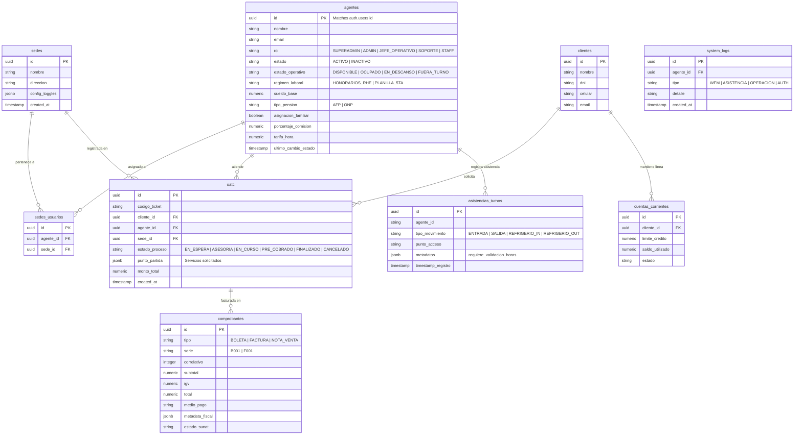
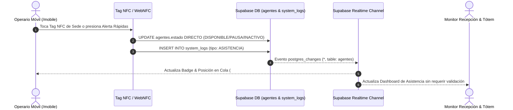
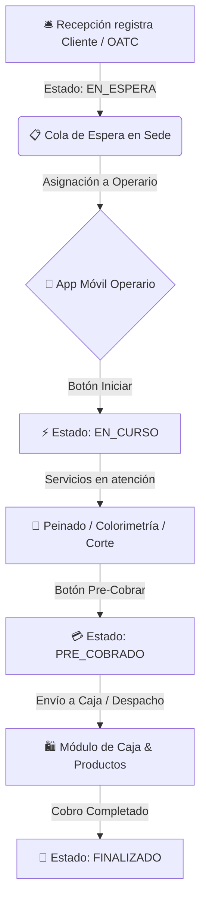
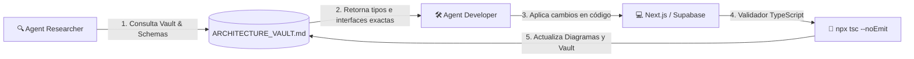

# 🏛️ Vault de Arquitectura & Diagramas del ERP (Obsidian Ready)

Este documento sirve como la **Base de Conocimiento Vivo** y mapa conceptual del sistema **Vaikuntha Enterprise ERP (Next.js + Supabase + Realtime)**. Está formateado con sintaxis compatible con **Obsidian** y diagramas **Mermaid**.

---

## 📊 1. Diagrama Entidad-Relación (ERD Base de Datos Supabase)

---

## 🔄 2. Flujo de Datos: Marcación WFM & Tag NFC (Sin Intermediación)

---

## ⚡ 3. Flujo de Vida de una OATC (Atención Operativa)

---

## 🤖 4. Estrategia de Subagentes & Mapeo Pre-Ejecución

Para cada requerimiento o refactorización futura en la webapp:

