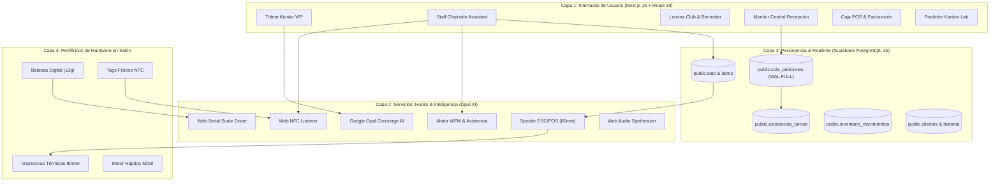

# 🗺️ Mapa Arquitectural Interactivo de Vaikuntha ERP (Archify)

Este directorio contiene la arquitectura del sistema **Vaikuntha ERP (Gloss Salon & Relax)** compilada bajo el estándar de **Archify** (`tt-a1i/archify`), generando un mapa técnico vivo, interactivo y con verificación determinista de dependencias.

---

## 🚀 Archivos de Arquitectura

1. **[Mapa Interactivo HTML/SVG](./vaikuntha_core.architecture.html)**:
   - Visor autónomo ejecutable en cualquier navegador sin dependencias ni servidor.
   - Conmutador de tema **Oscuro / Claro (Dark / Light)**.
   - Selector de preset visual: **Blueprint** (esquemático de alta ingeniería) y **Signal Flow** (pulsos reactivos de señal).
   - Filtro interactivo de roles: `UI / Next.js`, `Servicios & Hooks`, `Supabase DB`, `Hardware` e `IA Opal`.
   - **Inspección de Dependencias (Reach Tracing)**: Haz clic en cualquier nodo para aislar sus lecturas (*Upstream*) y sus mutaciones (*Downstream*).
   - **Modo Historia Guiada (4 Capítulos)**: Navegación secuencial paso a paso por los flujos críticos del salón.
   - **Exportación de Share Card (1200×630)** para documentación institucional y README.

2. **[Representación Intermedia Tipada (JSON IR)](./vaikuntha_core.architecture.json)**:
   - Esquema JSON determinista con 25 nodos tipados, 28 aristas categorizadas y 4 historias operativas.

---

## 🏛️ Las 4 Capas de la Arquitectura



---

## 🎬 Los 4 Capítulos Interactivos

1. **Capítulo 1: Check-in VIP & Bienvenida Concierge Opal**
   - Tótem táctil -> Inferencia Opal AI -> Consulta CRM -> Creación OATC (`EN_ESPERA`) -> Emisión de ticket térmico -> Alerta en tiempo real a recepción.
2. **Capítulo 2: Atención en Sillón, Diagnóstico & Despacho Químico**
   - Sillón de estilista -> Reclamo de orden -> Pedido a laboratorio -> Pesaje en balanza Web Serial (±2g) -> Deducción Kardex -> Aviso sonoro a sillón.
3. **Capítulo 3: Workforce Management & Marcación NFC**
   - Tag físico NFC -> Sanitizado NDEF -> Desambiguación táctil -> Inserción PENDIENTE -> Auditoría supervisada en recepción -> Inserción inmutable -> Vibración háptica.
4. **Capítulo 4: Emisión Térmica OATC & Facturación en Caja POS**
   - Finalización en sillón -> Liquidación en Caja POS -> Boleta/Factura SUNAT -> Impresión térmica 80mm -> Acumulación de LuminaCoins -> Arqueo ciego.

---

## 🛠️ Cómo Regenerar el Mapa Arquitectónico

Si agregas nuevos componentes, tablas o periféricos, actualiza `vaikuntha_core.architecture.json` y ejecuta:

```bash
npm run archify:build
```

El compilador validará deterministamente que todas las referencias entre nodos, aristas e historias existan y reescribirá el visor interactivo `vaikuntha_core.architecture.html`.
