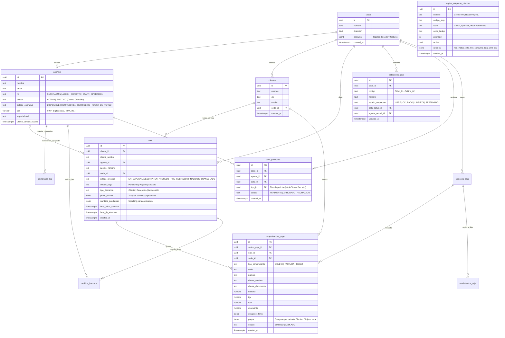
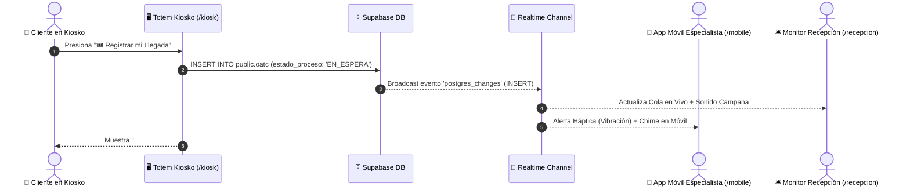

# 🏛️ 01. Arquitectura del Sistema & Base de Datos (Supabase PostgreSQL)
*Documento vivo compatible con Obsidian • Vaikuntha ERP v2.0*

---

## 📊 1. Diagrama Entidad-Relación Completo (ERD)

---

## 🔒 2. Taxonomía Estricta de Estados en `agentes`

Para evitar bloqueos administrativos y desacoplar el estado laboral del estado transaccional en piso:

| Columna | Valores Permitidos | Propósito & Reglas de Modificación |
| :--- | :--- | :--- |
| **`estado`** | `'ACTIVO'` \| `'INACTIVO'` | **Estado Administrativo de Contrato / Cuenta**. Solo puede ser modificado por el Superadmin en el panel `/admin/usuarios`. Ningún botón operativo, tag NFC o proceso WFM puede cambiar este valor. |
| **`estado_operativo`** | `'DISPONIBLE'` \| `'OCUPADO'` \| `'EN_REFRIGERIO'` \| `'FUERA_DE_TURNO'` | **Estado Dinámico en Piso**. Modificado en vivo por marcaciones NFC, Tótem Kiosko con PIN, asignación de OATC en Recepción y finalización de cobro en POS. |

---

## 🛡️ 3. Políticas de Seguridad (Row Level Security - RLS)

Todas las tablas operan con RLS habilitado en Supabase, con políticas simétricas para permitir funcionamiento sin fricción en terminales públicas de quiosco y POS:

1. **`public.oatc`**: Política `Permitir todo en oatc a public` para actualizaciones en tiempo real de recepción, quiosco y caja.
2. **`public.clientes`**: Política `Permitir todo en clientes a public` para autogestión y registro táctil en el Tótem Kiosko.
3. **`public.cola_peticiones`**: Política `Permitir todo en cola_peticiones a public` para solicitudes de cortesía de bar y autorizaciones con PIN.
4. **`public.comprobantes_pago`**: Política para emisión y cierre de sesiones de caja.

---

## 🔄 4. Flujo Realtime de Notificaciones (PostgreSQL Replication)

---

## 🩺 5. Arquitectura de Auto-Sanación (*Self-Healing State*)

Para evitar errores como **HTTP 406 (Not Acceptable)** causados por memorias residuales en el `localStorage` de navegadores antiguos:
- El servicio [`sedesConfig.ts`](file:///C:/Users/Admin/.gemini/antigravity/scratch/ERP-Supabase-VERCEL-Gonzales/src/services/sedesConfig.ts) utiliza `.maybeSingle()` en lugar de `.single()`.
- Si el ID almacenado en la caché del navegador fue eliminado o modificado en Supabase, el sistema busca automáticamente la primera sede activa válida (`Unidad de Prueba (Sandbox)`), actualiza el `store` de Zustand (`useAppStore`) y sobreescribe el `localStorage` silenciosamente.
