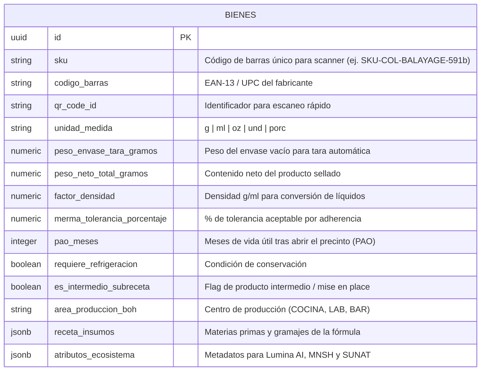
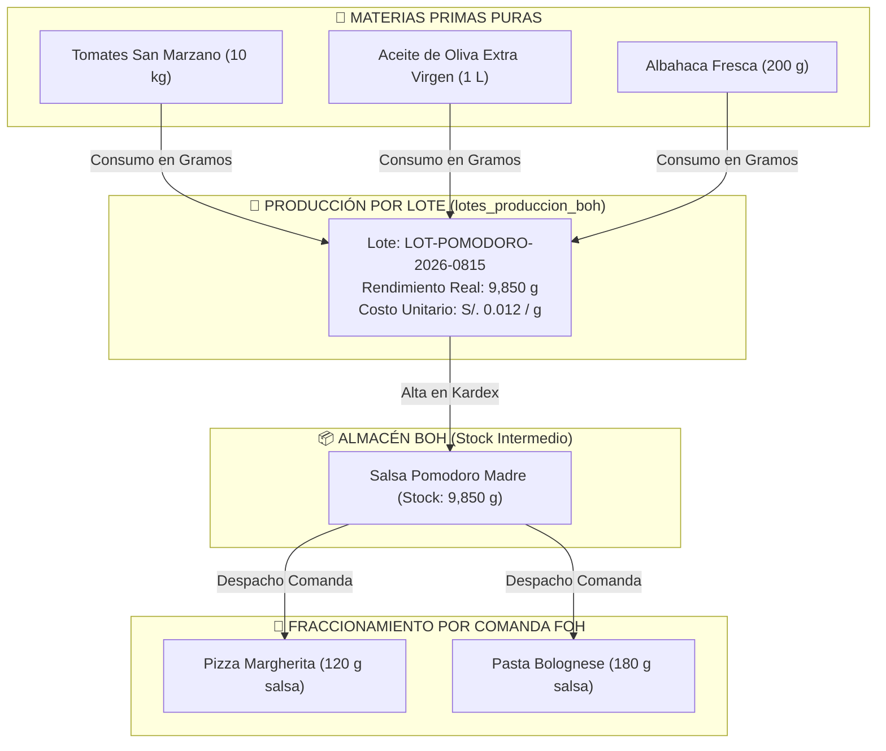

# 📦 ERP-01: Logística de Gramos, Kardex & Balanzas IoT Sincronizadas

> *"En cualquier negocio físico de transformación o aplicación (salones, clínicas, odontología, bares, restaurantes o talleres), el inventario no se mueve únicamente en cajas cerradas: se consume en **gramos, mililitros o porciones fraccionadas**. Vaikuntha ERP combina un WMS de alta precisión con **SKUs estandarizados, calibración de tara en balanzas IoT, despacho asistido de fórmulas (ODI) y gestión de lotes de sub-recetas (Mise en place BOH)**."*

---

## ⚖️ 1. Modelo de Metrología de Bienes para Balanzas IoT

Para que cualquier balanza digital conectada (por USB Serial o Bluetooth BLE) interactúe con el ERP sin errores de calibración, la tabla `public.bienes` cuenta con los siguientes campos metrológicos:



---

## 🧪 2. Ecuaciones de Calibración en Balanza Digital

Al colocar un recipiente con insumo sobre el plato de la balanza IoT:

$$\text{Peso Neto Real} = \text{Peso Bruto Medido} - \text{Peso Tara Envase}$$

$$\text{Volumen Neto (Líquidos)} = \frac{\text{Peso Neto Real}}{\text{Factor de Densidad}}$$

$$\text{Desviación de Merma \%} = \left(\frac{\text{Peso Neto Real} - \text{Peso Teórico Receta}}{\text{Peso Teórico Receta}}\right) \times 100$$

- **`DENTRO_TOLERANCIA`**: $|\text{Desviación \%}| \le \text{merma\_tolerancia\_porcentaje}$ ($\le \pm 3\%$). Semáforo Verde.
- **`EXCESO_DESPERDICIO`**: $\text{Desviación \%} > +3\%$. Semáforo Rojo (Sobredosificación y pérdida de margen).
- **`SUB_DOSIFICACION`**: $\text{Desviación \%} < -3\%$. Semáforo Ámbar (Riesgo en calidad del servicio o preparación).

---

## 🥗 3. Gestión y Fraccionamiento de Sub-Recetas (Mise en Place BOH)

En restaurantes y centros técnicos, ciertos insumos no se adquieren listos para usar, sino que se elaboran en lotes internos (ej. *Salsa Pomodoro Lote 10kg*, *Masa Napolitana Lote 50 und*, *Mezcla Decolorante Plex Batch 2kg*).



### Tabla `public.lotes_produccion_boh`:
- `codigo_lote`: Identificador alfanumérico único para trazabilidad sanitaria y rotación FIFO.
- `bien_intermedio_id`: Referencia al bien con `es_intermedio_subreceta = true`.
- `costo_unitario_gramo`: Costo calculado automáticamente dividiendo el costo total de las materias primas consumidas entre el peso neto resultante.
- `fecha_vencimiento`: Fecha límite de consumo según los días de vida útil del preparado.

---

## 📊 4. Kardex de Precisión & Auditoría de Mermas (`public.inventario_movimientos`)

Cada línea del Kardex almacena los datos de metrología física registrados por la balanza IoT:

| Campo | Tipo | Descripción |
| :--- | :--- | :--- |
| `cantidad_teorica` | `numeric` | Gramos solicitados en la receta estándar |
| `cantidad_real` | `numeric` | Gramos netos registrados en la Balanza IoT |
| `merma_delta_gramos` | `numeric` | $\text{cantidad\_real} - \text{cantidad\_teorica}$ |
| `merma_delta_porcentaje` | `numeric` | Variación porcentual sobre la receta |
| `estado_merma` | `text` | `DENTRO_TOLERANCIA`, `EXCESO_DESPERDICIO`, `SUB_DOSIFICACION` |
| `es_produccion_subreceta`| `boolean` | Indica si el movimiento corresponde a un lote de cocina/lab |
| `lote_produccion` | `text` | Código de lote asociado para trazabilidad |
| `metadata_iot` | `jsonb` | Peso bruto, tara del envase, densidad y estabilidad |

---

## 🌐 5. Atributos de Ecosistema e Interoperabilidad (`atributos_ecosistema`)

La columna `atributos_ecosistema` (`jsonb`) permite que otras herramientas utilicen el catálogo de forma especializada:

```json
{
  "lumina_ai": {
    "diagnostico_compatible": ["capilar", "tricologia"],
    "ph_estimado": 5.5,
    "porosidad_optima": ["MEDIA", "ALTA"],
    "fototipo_recomendado": ["II", "III", "IV"]
  },
  "mnsh_gamification": {
    "xp_otorgado": 25,
    "rareza": "EPIC",
    "insignia_asociada": "COLOR_MASTER",
    "monedas_reward": 5
  },
  "sunat_fiscal": {
    "codigo_sunat": "53131602",
    "tipo_afectacion_igv": "10_GRAVADO",
    "unidad_medida_sunat": "NIU"
  }
}
```

---

## 🔗 Navegación y Enlaces Cruzados
- [[00_Motor_Agnostico_Estaciones|🌿 ERP-00: Motor Agnóstico por Estaciones & WFM]]
- [[10_Filosofia_Comercial_Bienes_y_Gobernanza_Agnostica|🏛️ ERP-10: Filosofía Comercial & Sub-Recetas]]
- [[13_Arquitectura_Supabase_ERD_y_AutoSanacion|🗄️ ERP-13: Arquitectura Supabase & ERD]]
- [[README_INDICE_MAESTRO|🌿 Índice Maestro de Documentación]]
