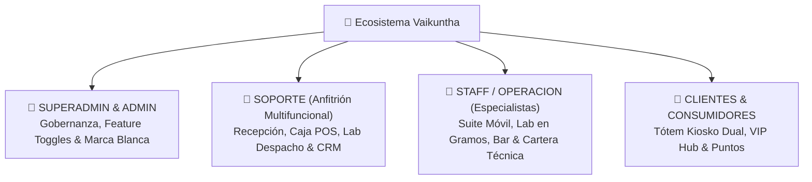

# 📘 02. Manual de Funcionamiento por Roles de Empoderamiento & Seguridad
*Guía de Operación Integral • Vaikuntha ERP v2.0*

Vaikuntha ERP estructura su operación en torno al **Empoderamiento Adaptativo**: en lugar de silos departamentales rígidos ('solo caja' o 'solo recepción'), el equipo de apoyo opera bajo el perfil de **SOPORTE**, habilitando herramientas operativas de forma granular según el crecimiento y capacitación del colaborador.

---

## 🗺️ Matriz de Perfiles Nucleares

---

## 👑 1. Rol: Superadmin & Administrador
**Rutas Principales**: `/admin/usuarios`, `/admin/config`, `/admin/reglas-clientes`, `/dev`

### Funciones Principales:
1. **Gobernanza de Personal & Delegación**:
   - Creación de colaboradores, asignación de especialidades y configuración del **PIN personal de 4 dígitos**.
   - **Matriz de Delegación Quirúrgica** (`/admin/usuarios`): Habilita o restringe con un clic qué herramientas del workspace puede usar cada colaborador de `SOPORTE` (`recepcion`, `caja`, `despacho`, `kiosko`, `arqueo`).
2. **Feature Toggles Quirúrgicos por Sede** (`/admin/config`):
   - Activación o desactivación de módulos según el tipo de sede:
     - Módulo de Laboratorio en Gramos (IoT).
     - Comisiones escalonadas.
     - Modo de asignación de estaciones (`AUTOMATICO_IOT`, `SEMI_AUTOMATICO_BUZON`, `MANUAL`).
     - Tótem Kiosko de Autoservicio.
     - Plug-in LuminaHQ AI Suite.
     - Datos de facturación electrónica SUNAT (RUC, Series).
3. **Gobernanza de Reglas de Clientes** (`/admin/reglas-clientes`):
   - Creación y ajuste de umbrales para insignias dinámicas: visitas mínimas en 30 días, consumo total acumulado, compras retail y fidelidad con especialistas.
4. **Consola de Desarrollador & Logs** (`/dev`):
   - Monitoreo en tiempo real de logs transaccionales (`system_logs`) con filtros por categoría: `AUTH`, `ASISTENCIA`, `WFM`, `OPERACION`, `CAJA`.

---

## 🤝 2. Rol: Soporte (Anfitrión Multifuncional)
**Rutas Principales**: `/recepcion`, `/caja`, `/lab/despacho`, `/recepcion/crm`, `/recepcion/historial`

El colaborador de **SOPORTE** es el corazón operativo del salón. Según las herramientas delegadas por el Administrador, puede desenvolverse fluidamente en:

1. **Workspace Recepción & Semáforo de Piso**:
   - Registro de clientes, toma de demanda OATC, asignación de especialistas disponibles y monitor de cola en sala.
   - Aprobación de solicitudes de upselling en el Buzón de Autorizaciones.
2. **Punto de Venta (Caja POS)**:
   - Cobranza multi-método flexible (Efectivo con cálculo de vuelto, Tarjeta, Yape, Cortesías).
   - Ejecución de la **Liberación en Cascada Atómica** (marca OATC pagada, libera especialista a `DISPONIBLE` y estación a `LIBRE`).
   - Cierre ciego de caja con cálculo automático de arqueo.
3. **Laboratorio & Despacho ODI**:
   - Pesaje exacto de fórmulas de tintes con balanzas IoT y auditoría de mermas.
4. **Directorio Central CRM**:
   - Seguimiento de clientes VIP, métricas de consumo acumulado e insignias ganadas.

---

## 💈 3. Rol: Staff & Especialista de Salón
**Rutas Principales**: `/mobile/operacion`, `/kiosk` (Modo Staff)

### Funciones Principales:
1. **Control de Asistencia WFM**:
   - Marcación de inicio de turno, refrigerio y fin de jornada con **Web NFC** o **PIN de 4 dígitos**.
2. **Suite Móvil Operativa**:
   - Alerta háptica (vibración) y sonora (chime) ante nuevas órdenes OATC asignadas.
   - Solicitud de mezclas químicas en gramos al laboratorio.
   - Pedido de café y bebidas de cortesía al bar para su cliente en atención.
   - Envío de tickets a Caja mediante el botón **"Solicitar Pre-Cobro"**.
3. **Cartera CRM Personal**:
   - Fórmulas técnicas históricas, notas de colorimetría y preferencias del cliente.
4. **Historial & Auditoría**:
   - Registro de atenciones realizadas en los últimos 30 días, desglose de comisiones e insumos despachados por balanza IoT.

---

## 👥 4. Rol: Cliente & Consumidor
**Rutas Principales**: `/kiosk` (Modo Cliente), `/cliente`

### Funciones Principales:
1. **Acceso Táctil & Directorio Rápido**:
   - Ingreso por teclado táctil de DNI / Celular o selección en 1 toque de su tarjeta de membresía.
2. **Autogestión de Turno**:
   - Botón **"🎟️ Registrar mi Llegada"** para crearse automáticamente en la cola de Recepción como `EN_ESPERA`.
3. **Bar & Cafetería de Bienvenida**:
   - Menú de cortesía interactivo para pedir café espresso, capuchino, jugo natural o cocktail VIP mientras espera en sala.
4. **Pasaporte Digital `Vaikuntha Points 💎`**:
   - Visualización de su balance de puntos (`VP 💎`), nivel de fidelidad (Bronce a Diamante VIP) e historial de visitas.
5. **Registro Express**:
   - Formulario táctil en 20 segundos que le otorga **100 VP de bono de bienvenida**.
