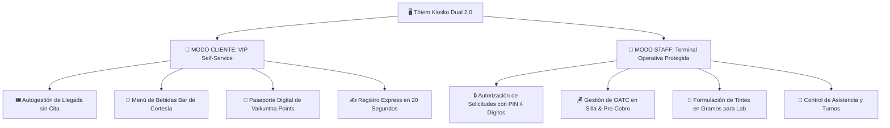
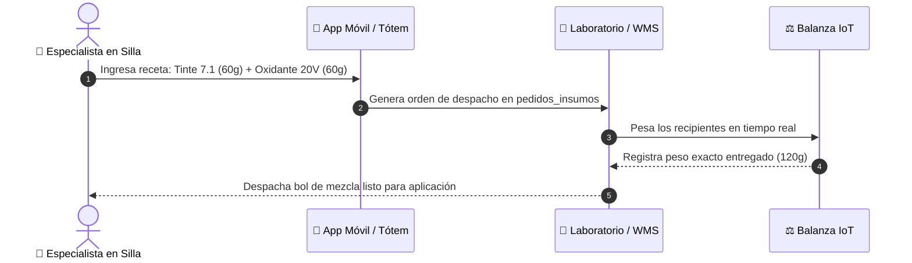

# 💎 03. Features Únicas, Innovaciones & Arquitectura White-Label
*Diferenciadores Tecnológicos • Vaikuntha ERP v2.0*

Este documento recopila las innovaciones propietarias y capacidades de personalización de **Vaikuntha ERP**, diseñadas para destacar frente a los ERPs tradicionales del mercado.

---

## 🏷️ 1. Motor de Marca Blanca & Fidelización Dinámica

El ERP cuenta con una arquitectura de **Marca Blanca (Multi-Tenant Ready)** centralizada en [`src/config/branding.ts`](file:///C:/Users/Admin/.gemini/antigravity/scratch/ERP-Supabase-VERCEL-Gonzales/src/config/branding.ts):

```typescript
export interface TenantBranding {
  brandName: string;          // 'Vaikuntha', 'Lumina Salon', 'Barber Club'
  brandShortName: string;     // 'VKN'
  tagline: string;            // 'Intelligent Beauty & Wellness Ecosystem'
  logoLetter: string;         // 'V'
  loyalty: {
    pointsName: string;       // 'Vaikuntha Points'
    pointsShort: string;      // 'VP'
    pointsSymbol: string;     // '💎'
    coinConversionRate: number;// 1 PEN = 1 VP
    welcomeBonus: number;     // 100 VP
    tiers: {
      bronze: { name: 'Bronce VIP', minPoints: 0 };
      silver: { name: 'Plata VIP', minPoints: 200 };
      gold: { name: 'Oro VIP', minPoints: 400 };
      platinum: { name: 'Platino VIP', minPoints: 800 };
      diamond: { name: 'Diamante VIP', minPoints: 1200 };
    };
  };
}
```

### Ventajas Competitivas:
- **Adaptación Instantánea**: Al vender o licenciar el ERP a una nueva cadena de salones o clínicas estéticas, basta con configurar los parámetros desde la Consola de Desarrollador (`/admin/developers`) para cambiar el nombre, logotipos, colores e identidad del programa de lealtad sin tocar el código fuente.
- **Bono de Bienvenida Automático**: Todo cliente registrado en el quiosco o recepción recibe automáticamente sus 100 puntos iniciales para incentivar la recurrencia.

---

## 🖥️ 2. Tótem Kiosko Dual 2.0 (Dual-Mode Terminal)

Una sola pantalla táctil física en la entrada del salón cumple dos funciones de alto impacto:



### Blindaje de Seguridad por PIN:
- Para evitar que colaboradores marquen asistencia por otros o toquen órdenes ajenas en la terminal táctil compartida, cualquier acción en Modo Staff requiere ingresar su **PIN personal de 4 dígitos** (validado en Supabase con feedback háptico y sonoro de rechazo si es incorrecto).

---

## 🧪 3. Módulo de Laboratorio & Formulación en Gramos (IoT Ready)

Resuelve uno de los mayores dolores de la industria de la belleza: el desperdicio y descontrol en la mezcla de tintes y cosmecéuticos.



- **Auditoría de Mermas**: El sistema compara los gramos solicitados por el especialista contra los gramos despachados por la balanza, detectando discrepancias y calculando el costo real de insumos por cada ticket de atención.

---

## 🏷️ 4. Segmentación Dinámica & Motor de Insignias CRM

A diferencia de los CRMs convencionales con etiquetas manuales y estáticas:
- **Cálculo en Caliente**: Las insignias se re-evalúan dinámicamente con cada OATC y comprobante emitido.
- **Insignias Configurables por el Negocio**:
  - 👑 **`Cliente VIP`**: Consumo > S/ 700.00 en los últimos 30 días.
  - ✨ **`Cliente Retail VIP`**: Consumo en productos para el hogar > S/ 700.00 en el último mes.
  - 🤝 **`Cliente Fidelizado`**: Más de 4 atenciones con su especialista de preferencia.
  - 🛍️ **`Cliente Retail`**: Compra de productos de acabado capilar o cuidado domiciliario.
  - 👤 **`Cliente Identificado`**: Cliente registrado con historial comprobado.

---

## 💳 5. POS Omnicanal con Liberación en Cascada

- **Cobro Flexible Multi-Método**: Permite dividir un ticket entre Efectivo, Tarjeta, Yape y Cortesías en una sola transacción.
- **Liberación Atómica**: Al emitir el comprobante, una única transacción en Supabase actualiza:
  1. `oatc.estado_proceso = 'FINALIZADO'` y `oatc.estado_pago = 'Pagado'`.
  2. `agentes.estado_operativo = 'DISPONIBLE'` (libera al especialista para la siguiente atención).
  3. `estaciones_piso.estado_ocupacion = 'LIBRE'` (libera el sillón en el semáforo de piso).
- **Impresión Térmica Directa**: Compatible con impresoras térmicas ESC/POS de 58mm y 80mm vía USB, Bluetooth y red local.

---

## 🩺 6. Resiliencia & Auto-Sanación del Estado Frontend (*Self-Healing State*)

- **Cero Errores 406/400**: El frontend implementa el patrón `.maybeSingle()` y fallback automático de sede para garantizar que, ante limpiezas de base de datos o migraciones de sede, la aplicación se recupere instantáneamente sin requerir que el usuario borre su caché.
