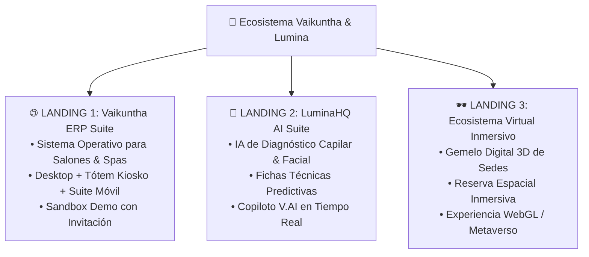
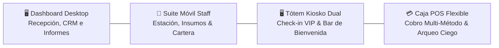
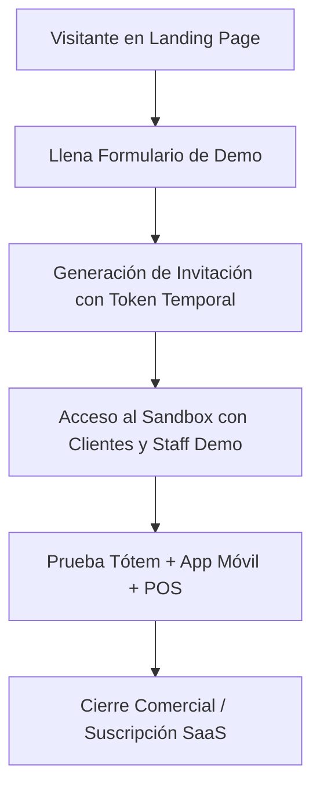

# 🌐 04. Landing Pages: Arquitectura, Copywriting & Estrategia de Lanzamiento
*Guía de Conversión y Estructura Web • Vaikuntha & Lumina Ecosystem*

Este documento detalla la estructura, propuesta de valor, wireframes conceptuales y textos persuasivos (copywriting) para las **3 Landing Pages** que presentarán el ecosistema antes del despliegue en producción en Vercel.

---

## 🗺️ Visión General de los 3 Productos

---

## 🚀 LANDING PAGE 1: Vaikuntha ERP Suite
*El Sistema Operativo Definitivo para Salones de Alta Gama, Spas y Cadenas de Belleza*

### 1. Hero Section (Arriba del Pliegue)
- **Badge**: `⚡ NUEVA GENERACIÓN • ERP PARA SALONES & SPAS`
- **Titular Principal (H1)**:  
  **"Transforma tu Salón en un Ecosistema Inteligente: Desde el Tótem de Entrada hasta la App Móvil de tu Equipo."**
- **Subtítulo (P)**:  
  *"Controla tiempos de atención, formula tintes al gramo con balanzas IoT, fideliza clientes con puntos automáticos y cobra en segundos con nuestro POS omnicanal. Todo sincronizado en tiempo real."*
- **Call to Actions (CTAs)**:
  - Primario: **`🎮 Solicitar Invitación al Sandbox Demo`** (Botón destacado con icono de invitación).
  - Secundario: **`▶️ Ver Video Tour de 2 Minutos`**.
- **Social Proof Bar**:  
  *"Diseñado para salones que atienden +500 servicios al mes • Cero fricción operativa • Multi-Sede & Marca Blanca Ready."*

---

### 2. Los 4 Pilares del Ecosistema Vaikuntha

#### Pilar A: Tótem Kiosko Dual 2.0 (La bienvenida que tu cliente merece)
- **Copy**: *"Permite que tus clientes VIP registren su llegada en 1 toque, consulten su saldo de puntos de lealtad y pidan un espresso de bienvenida mientras esperan. Y para tu equipo: una terminal protegida por PIN para gestionar turnos sin invadir la recepción."*

#### Pilar B: Suite Móvil para Colaboradores (Cero papel, máxima agilidad)
- **Copy**: *"Cada especialista recibe sus órdenes en su propio móvil con alertas hápticas y sonoras. Pueden solicitar fórmulas de tintes al laboratorio, pedir cortesías al bar y consultar el historial técnico de cada cliente al instante."*

#### Pilar C: Módulo de Laboratorio IoT en Gramos (Elimina el desperdicio de tintes)
- **Copy**: *"El 15% del costo de un salón se pierde en mezclas sobrantes. Con Vaikuntha ERP, las fórmulas se solicitan en gramos exactos y se auditan contra balanzas IoT en el laboratorio. Auditoría de mermas en tiempo real."*

#### Pilar D: Caja POS Omnicanal & Arqueo Ciego
- **Copy**: *"Cobra en efectivo con cálculo de vuelto, tarjetas, Yape y cortesías en un solo ticket. Al emitir el comprobante, el sillón y el especialista quedan libres de inmediato para la siguiente atención."*

---

### 3. Programa de Lealtad & Marca Blanca (White-Label)
- **Titular**: **"Tu Marca, Tus Reglas, Tus Puntos de Lealtad."**
- **Beneficio**: *"Configura tu propio programa de fidelización con nombre y logotipo personalizado (`Vaikuntha Points 💎`). Otorga bonos automáticos de bienvenida y sube de nivel a tus clientes más valiosos (Bronce, Plata, Oro, Platino, Diamante)."*

---

### 4. Sección de Conversión: Acceso Exclusivo al Sandbox Demo
- **Titular**: **"Prueba Vaikuntha ERP en Vivo con Datos Reales Antes de Comprar."**
- **Texto**: *"No te conformes con capturas estáticas. Solicita tu enlace de invitación y accede a una instancia Sandbox interactiva con 6 clientes y 3 especialistas precargados para probar el quiosco, la app móvil y el POS en vivo."*
- **Formulario de Invitación**:
  - Nombre del Negocio / Salón.
  - Nombre del Contacto & Cargo.
  - Correo Corporativo & WhatsApp.
  - Número de sedes y especialistas.
  - Botón: **`🚀 Generar Invitación al Sandbox Demo`**.

---

## 🧠 LANDING PAGE 2: LuminaHQ AI Suite
*Inteligencia Artificial Propietaria para Diagnóstico, Fichas Técnicas & Copiloto Comercial*

### 1. Hero Section
- **Badge**: `🧠 INTELIGENCIA ARTIFICIAL APLICADA A LA BELLEZA`
- **Titular (H1)**:  
  **"El Copiloto de Inteligencia Artificial que Multiplica el Ticket Promedio de tu Salón."**
- **Subtítulo**:  
  *"Diagnósticos capilares y dérmicos de precisión médica, fórmulas químicas sugeridas por IA y recomendaciones automáticas de productos retail para cada tipo de cabello."*
- **CTA**: **`✨ Probar Diagnóstico con IA (Demo Gratuita)`**.

### 2. Módulos de LuminaHQ AI
1. **Ficha Técnica Inteligente**: Análisis de porosidad, elasticidad y tono base para recomendar la mezcla exacta de coloración sin errores técnicos.
2. **Recomendador de Retail Predictivo**: Detecta qué producto para el hogar (serums, mascarillas, termoprotectores) necesita el cliente según el servicio realizado, aumentando las ventas retail en un +35%.
3. **Copiloto V.AI**: Asistente conversacional para administradores para consultar métricas: *"¿Cuál fue el especialista con mayor índice de upselling esta semana?"* o *"¿Qué clientes VIP no nos visitan hace más de 20 días?"*.

---

## 🕶️ LANDING PAGE 3: Ecosistema Virtual Inmersivo
*El Gemelo Digital 3D & Metaverso del Bienestar*

### 1. Hero Section
- **Badge**: `🌐 EXPERIENCIA WEBGL & REALIDAD INMERSIVA`
- **Titular (H1)**:  
  **"La Experiencia de tu Salón Más Allá de las Paredes Físicas."**
- **Subtítulo**:  
  *"Permite a tus clientes recorrer tu sede en un entorno 3D fotorrealista, elegir su estación favorita, conocer a los estilistas en avatar interactivo y reservar servicios premium desde cualquier dispositivo."*
- **CTA**: **`🕶️ Explorar Salón Virtual 3D`**.

---

## 📈 Embudo de Conversión & Flujo de Onboarding

