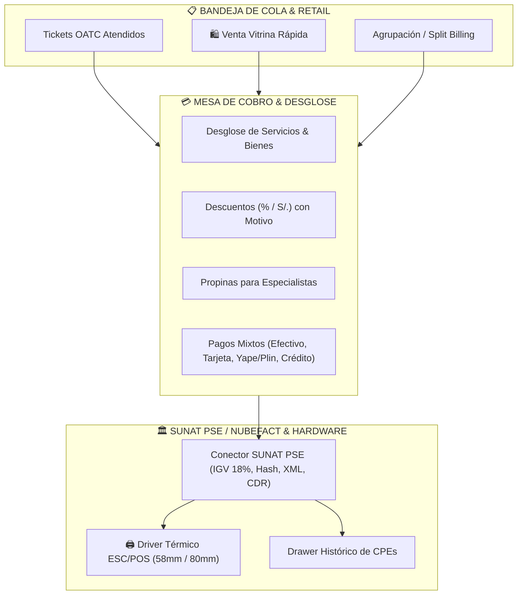

# 💳 Workspace Venta — Punto de Venta Todo-en-Uno & Facturación SUNAT PSE

El **Workspace Venta** (`/caja`) es el centro neurálgico de cobro omnicanal, liquidación y emisión tributaria de Vaikuntha ERP. Diseñado bajo el principio de **cero fricción operativa**, unifica en un layout de 2 columnas de alta densidad tanto la gestión de órdenes en cola (OATCs) como la venta rápida de mostrador/retail, con emisión fiscal en tiempo real a SUNAT a través de proveedores PSE/OSE autorizados (Nubefact).

---

## 🗺️ Mapa de Navegación del Vault
- [[README]] — Índice General del Vault
- [[01_ARQUITECTURA_Y_BASE_DE_DATOS]] — Esquema relacional y tablas `comprobantes`, `facturas`, `cuentas_corrientes`
- [[02_MANUAL_DE_FUNCIONAMIENTO_POR_ROLES]] — Roles de Cajero y Finanzas
- [[07_WFM_ASISTENCIA_REGIMEN_LABORAL]] — Conciliación de comisiones con RHE y Planilla

---

## 🏛️ 1. Arquitectura del POS Todo-en-Uno



---

## ⚡ 2. Características Principales

### A. Layout de 2 Columnas de Alta Densidad
1. **Columna Izquierda (40%) — Cola de Espera & Tickets**:
   - Selector multi-ticket para **Split Billing** y agrupación de múltiples OATCs para un solo pago familiar/corporativo.
   - Botón `➕ Venta Vitrina / Retail`: Permite facturar productos de mostrador o servicios directos sin necesidad de crear una OATC previa en recepción.
   - Indicador de estado de turno con botón de `Arqueo Ciego`.
2. **Columna Derecha (60%) — Mesa de Cobro & Emisión**:
   - Resumen detallado de ítems, precios unitarios, cantidades e insumos aplicados.
   - Panel de **Descuentos con auditoría de motivo**.
   - Input de **Propina voluntaria para el staff** con cálculo transparente.
   - Matriz de **Medios de Pago Mixtos** con cálculo automático de vuelto para pagos en efectivo.

---

### B. Emisión Fiscal SUNAT PSE / Nubefact ([`src/services/sunatPSE.ts`](file:///C:/Users/Admin/.gemini/antigravity/scratch/ERP-Supabase-VERCEL-Gonzales/src/services/sunatPSE.ts))

El conector PSE genera comprobantes electrónicos válidos ante la SUNAT con homologación automática:

```typescript
export interface DatosComprobantePSE {
  tipo: 'BOLETA' | 'FACTURA' | 'NOTA_VENTA';
  serie: string;          // Ej. B001, F001
  numero?: number;
  cliente: {
    tipoDoc: '1' | '6' | '0' | '4' | '7'; // 1=DNI, 6=RUC, 0=Sin Doc
    numDoc: string;
    razonSocial: string;
    direccion?: string;
  };
  items: Array<{
    codigo: string;
    descripcion: string;
    cantidad: number;
    precioUnitario: number;
    tipoIgv: '10' | '20' | '30'; // 10=Gravado 18%
  }>;
  medioPago: 'EFECTIVO' | 'TARJETA' | 'YAPE' | 'PLIN' | 'TRANSFERENCIA' | 'CREDITO_CLIENTE';
  descuento?: number;
  propina?: number;
}
```

- **Cálculo de Impuestos**: Desglose exacto de Operación Gravada (`subtotal = total / 1.18`) e `IGV (18%)`.
- **Código QR Legal SUNAT**: Cadena estructurada `RUC | TipoDoc | Serie | Correlativo | IGV | Total | Fecha | TipoDocCliente | NumDocCliente | Hash`.
- **Artefactos Digitales**: Almacena URLs de PDF oficial, XML firmado y Constancia de Recepción (CDR).

---

### C. Driver Térmico ESC/POS con Auto-Ajuste 58mm / 80mm ([`src/lib/hardware/thermalPrinter.ts`](file:///C:/Users/Admin/.gemini/antigravity/scratch/ERP-Supabase-VERCEL-Gonzales/src/lib/hardware/thermalPrinter.ts))

Soporta terminales POS fijas y mini-impresoras Bluetooth/USB portátiles:
- **80mm Estándar**: Ancho imprimible de `72mm`, tipografía `11px`, 48 columnas de caracteres.
- **58mm Mini POS**: Ancho imprimible de `48mm`, tipografía `9px`, 32 columnas de caracteres con auto-truncado tipográfico para que los precios nunca se desborden ni se corten.
- **Modal de Previsualización Térmica**: Permite al cajero inspeccionar el ticket antes de imprimir y alternar el formato con 1 clic.

---

### D. Cuentas por Cobrar & Consumos a Crédito ([`/caja/cuentas`](file:///C:/Users/Admin/.gemini/antigravity/scratch/ERP-Supabase-VERCEL-Gonzales/src/app/(dashboard)/caja/cuentas/page.tsx))

- Registro de consumos a crédito para clientes corporativos o VIP autorizados.
- Control de límite de crédito, saldo deudor y días de mora.
- Modal de liquidación de abonos con opción de emitir Comprobante de Pago Electrónico (Boleta/Factura) en el momento del pago de la deuda.

---

## 📋 3. Operación del Arqueo Ciego de Caja

1. El cajero abre su turno con un **Fondo Inicial (S/.)**.
2. Durante el día, todas las ventas en efectivo, tarjeta, transferencias y billeteras digitales se totalizan en la base de datos de manera oculta (*ciega*).
3. Al finalizar el turno, el cajero ejecuta el **Arqueo Ciego**, ingresando únicamente el recuento físico de monedas, billetes y vouchers.
4. El sistema compara el conteo con el sistema contable y genera el reporte de sobrante/faltante para auditoría.
