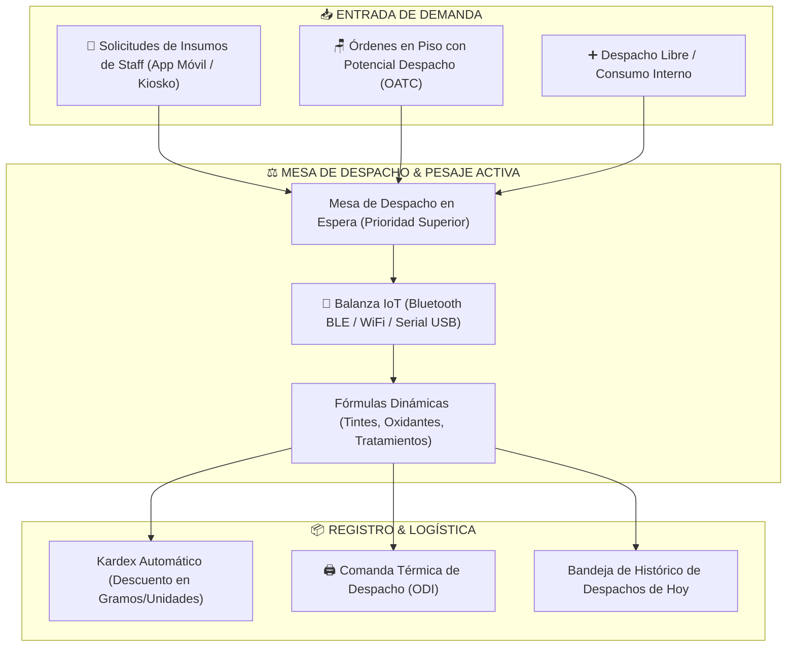

# 🧪 Workspace Taller — Despacho de Insumos, Fórmulas Dinámicas & Balanzas IoT

El **Workspace Taller** (`/lab/despacho`) es la estación central de trastienda (Back of House - BOH) encargada de la preparación, pesaje de precisión y despacho de insumos químicos, fórmulas capilares/estéticas y bienes de consumo interno de la sede.

---

## 🗺️ Mapa de Navegación del Vault
- [[README]] — Índice General del Vault
- [[01_ARQUITECTURA_Y_BASE_DE_DATOS]] — Tabla `almacen_laboratorio`, `movimientos_kardex`
- [[01_Logistica_Gramos_Kardex]] — Arquitectura de pesaje en gramos y merma técnica
- [[03_FEATURES_UNICAS_Y_WHITE_LABEL]] — Calibración IoT y balanzas

---

## 🏛️ 1. Arquitectura del Flujo de Despacho

---

## ⚡ 2. Características Principales

### A. Jerarquía y Ergonomía Visual de la Mesa de Despacho
Para maximizar la agilidad del despachador y reducir la resistencia al cambio:
1. **Mesa de Despacho en Espera (Arriba)**: Se activa inmediatamente cuando un especialista solicita insumos para una orden, permitiendo atender la fórmula sin navegar entre menús.
2. **Cola de Solicitudes de Staff (Prioridad Alta)**: Insumos pedidos explícitamente desde la aplicación móvil del colaborador.
3. **Órdenes de Atención en Piso (Potencial Despacho)**: Lista de clientes siendo atendidos en estaciones para que el taller pueda pre-elaborar o despachar en modo flexible.

---

### B. Hardware IoT & Balanzas Digitales ([`src/lib/iot/balanzaDriver.ts`](file:///C:/Users/Admin/.gemini/antigravity/scratch/ERP-Supabase-VERCEL-Gonzales/src/lib/iot/balanzaDriver.ts))

Soporta múltiples canales de comunicación para captura de peso en gramos con precisión de 0.1g:
- **Bluetooth BLE (Web Bluetooth API)**: Conexión inalámbrica directa desde el navegador Chrome/Edge hacia balanzas digitales comerciales y basadas en ESP32/HX711.
- **WiFi Local (WebSockets / HTTP ESP32)**: Lectura continua en tiempo real con indicador visual de estabilidad (`ESTABLE` vs `PESANDO...`).
- **USB Serial (Web Serial API)**: Conexión cableada ultra-estable para estaciones fijas de laboratorio.
- **Fallback Manual**: Si la sede no dispone de hardware IoT, se ingresan los gramos mediante teclado numérico touch.

---

### C. Despacho Libre & Mermas Técnicas

- **Despacho Libre**: Permite registrar el uso de productos de limpieza, toallas, tinturas de prueba o insumos administrativos sin vincularlos a un cliente u orden específica.
- **Trazabilidad en Kardex**: Cada gramo despachado descuenta en tiempo real del stock de la sede en `almacen_laboratorio`, actualizando el valor monetario del inventario y alertando de quiebres de stock.
