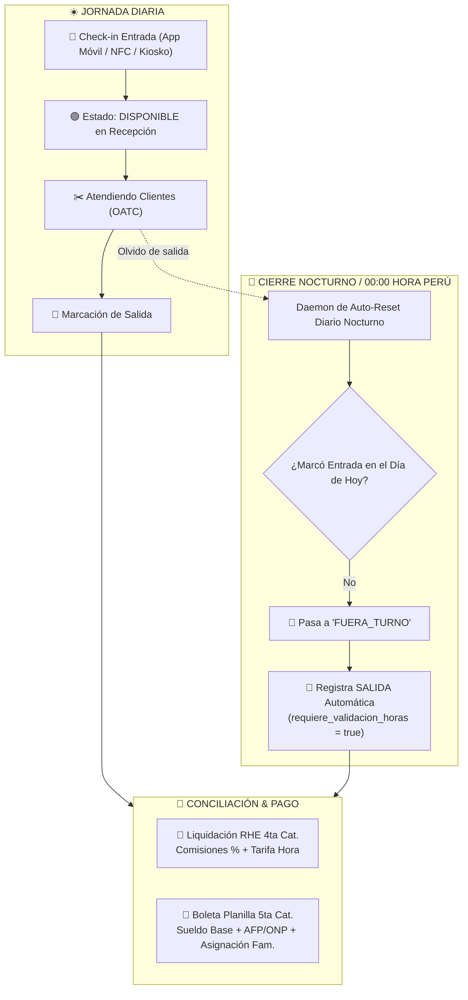

# 🕒 WFM, Asistencia, Reset Nocturno & Doble Régimen Laboral (RHE vs Planilla)

Este módulo documenta la arquitectura de **Gestión de Fuerza Laboral (Workforce Management - WFM)**, control biométrico/NFC de asistencia, protección de disponibilidad de staff al inicio del día y la liquidación salarial bajo los dos regímenes tributarios oficiales en Perú: **Recibos por Honorarios (RHE 4ta Cat.)** y **Planilla de Sueldos (5ta Cat.)**.

---

## 🗺️ Mapa de Navegación del Vault
- [[README]] — Índice General del Vault
- [[01_ARQUITECTURA_Y_BASE_DE_DATOS]] — Tablas `agentes`, `asistencias_turnos`, `cola_peticiones`
- [[02_MANUAL_DE_FUNCIONAMIENTO_POR_ROLES]] — Roles de Staff, Jefe Operativo y Administración
- [[05_WORKSPACE_VENTA_SUNAT_PSE]] — Emisión tributaria de caja y comisiones

---

## 🏛️ 1. Ciclo de Vida de Disponibilidad & Reset Diario

---

## ⚡ 2. Componentes de la Solución

### A. Reset Nocturno Automático de Disponibilidad ([`src/services/asistencias.ts`](file:///C:/Users/Admin/.gemini/antigravity/scratch/ERP-Supabase-VERCEL-Gonzales/src/services/asistencias.ts))

- **Problema Resuelto**: En operaciones continuas, es común que colaboradores olviden marcar salida al terminar su turno, quedando como `DISPONIBLE` en el sistema al día siguiente. Esto generaba que recepción les asignara clientes a primera hora sin que hubieran llegado al local.
- **Mecanismo de Auto-Reset**: A las 00:00 (-05:00 America/Lima) o al activar el toggle de sede, el sistema evalúa a todos los colaboradores en estado `DISPONIBLE` u `OCUPADO`. Si no cuentan con un registro de `ENTRADA` con timestamp de hoy, son pasados automáticamente a `FUERA_TURNO`.
- **Cierre Masivo de Sede**: Permite al administrador presionar el botón `🏁 Cierre Masivo de Jornada` en `/admin/config` para desconectar a todo el personal de piso al bajar las persianas del local.

---

### B. Configuración de Doble Régimen Laboral ([`/admin/usuarios`](file:///C:/Users/Admin/.gemini/antigravity/scratch/ERP-Supabase-VERCEL-Gonzales/src/app/(dashboard)/admin/usuarios/page.tsx))

En el sector de belleza, salud y servicios conviven dos modalidades de contratación. El ERP permite configurar de forma granular por cada usuario:

| Régimen Laboral | Modalidad Tributaria | Parámetros Configurables | Base de Cálculo |
| :--- | :--- | :--- | :--- |
| **🧾 Honorarios RHE** | 4ta Categoría (Independiente) | • `% Comisión por Servicios` (ej. 40%) • `Tarifa por Hora / Turno` | Comisión sobre ventas de servicios en OATCs cerradas + Horas efectivas asistidas. |
| **📄 Planilla de Sueldos** | 5ta Categoría (Dependiente) | • `Sueldo Base Mensual` • `Régimen Pensionario (AFP / ONP)` • `Asignación Familiar (+10% RMV)` | Sueldo fijo mensual, descuentos de ley (AFP/ONP 13%), horas extras y asignación familiar. |

---

### C. Conciliación Inteligente de Horas Efectivas

1. **Jornadas Regulares (Entrada + Salida marcadas)**:
   - Las horas de trabajo y comisiones se totalizan automáticamente sin requerir intervención humana.
2. **Jornadas con Olvido de Marcación**:
   - El sistema marca el registro con `metadatos.requiere_validacion_horas = true`.
   - En la bandeja de conciliación, la administración visualiza la inconsistencia y puede aprobar con 1 solo clic la hora sugerida basada en la **última OATC atendida del colaborador** o el fin pactado de su jornada.
