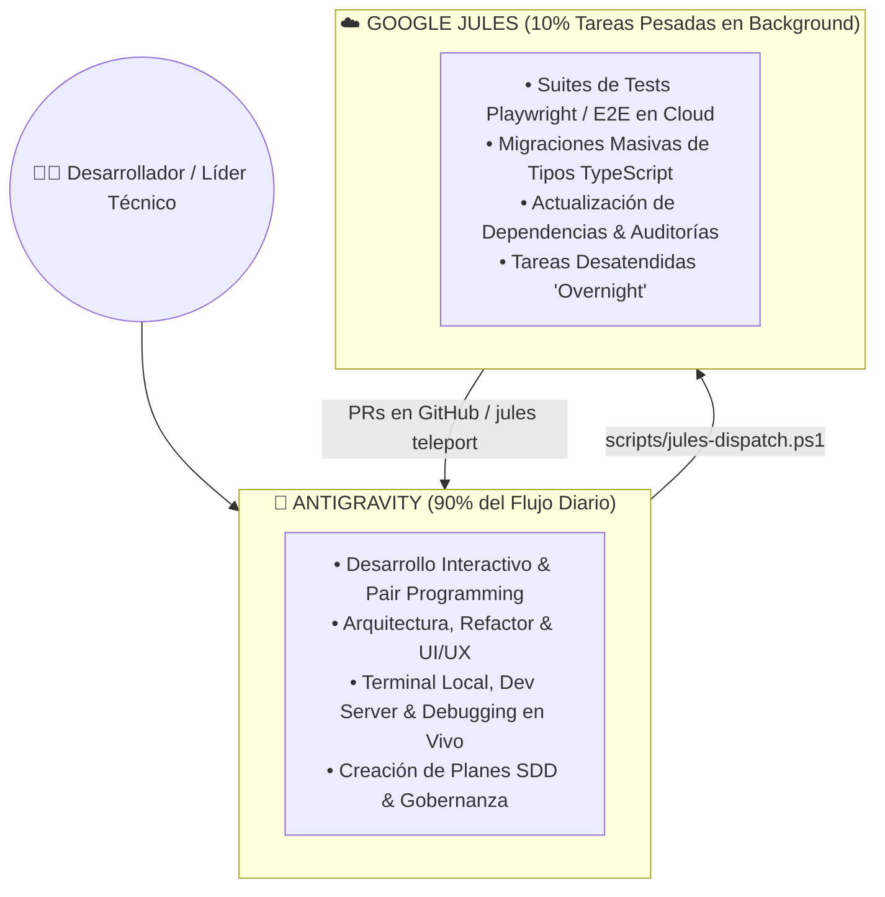

# 🤖 Integración y Automatización con Google Jules (`jules.google.com`)

Este módulo describe la arquitectura de co-programación y delegación autónoma en la nube entre **Antigravity (Google DeepMind)** y **Google Jules**, permitiendo ejecutar refactorizaciones masivas, migraciones y suites de tests Playwright en paralelo sin bloquear la sesión de desarrollo local.

---

## 🗺️ Mapa de Navegación del Vault
- [[README]] — Índice General del Vault
- [[01_ARQUITECTURA_Y_BASE_DE_DATOS]] — Estructura del codebase
- [[05_WORKSPACE_VENTA_SUNAT_PSE]] — Pruebas del conector SUNAT

---

## 🏛️ 1. Estrategia Híbrida de Co-Programación (90/10)



---

## ⚡ 2. Herramientas y Configuración

### A. CLI Oficial de Google Jules
- **Paquete**: `@google/jules` instalado globalmente.
- **Autenticación**: `jules login` mediante cuenta autorizada de Google.

### B. Directrices de Agentes ([`AGENTS.md`](file:///C:/Users/Admin/.gemini/antigravity/scratch/ERP-Supabase-VERCEL-Gonzales/AGENTS.md))
El archivo `AGENTS.md` en la raíz del proyecto provee el contexto que Jules lee al inicializar cualquier sandbox en la nube:
1. Arquitectura de Next.js App Router y TypeScript estricto.
2. Contratos con Supabase y Row Level Security.
3. Reglas de diseño UI/UX y prevención de regresiones.

### C. Helper de Despacho ([`scripts/jules-dispatch.ps1`](file:///C:/Users/Admin/.gemini/antigravity/scratch/ERP-Supabase-VERCEL-Gonzales/scripts/jules-dispatch.ps1))
Permite a Antigravity y al desarrollador interactuar con sesiones remotas de Jules mediante PowerShell:

```powershell
# Listar sesiones cloud activas
.\scripts\jules-dispatch.ps1 -Action list

# Despachar una nueva tarea en background a Jules
.\scripts\jules-dispatch.ps1 -Action new -Prompt "Ejecutar y corregir tests de Playwright para Workspace Venta"

# Traer los cambios completados por Jules al workspace local
.\scripts\jules-dispatch.ps1 -Action teleport
```
