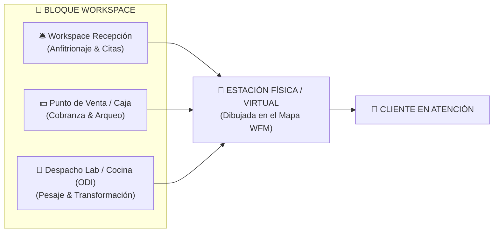
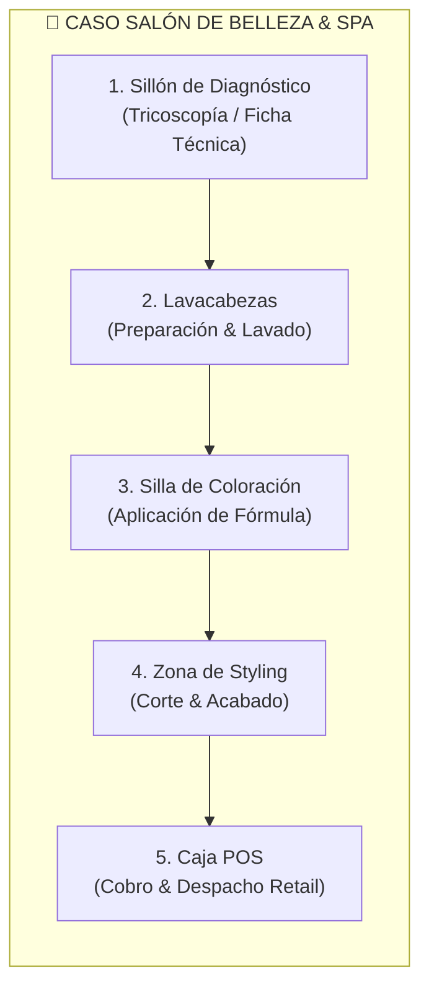
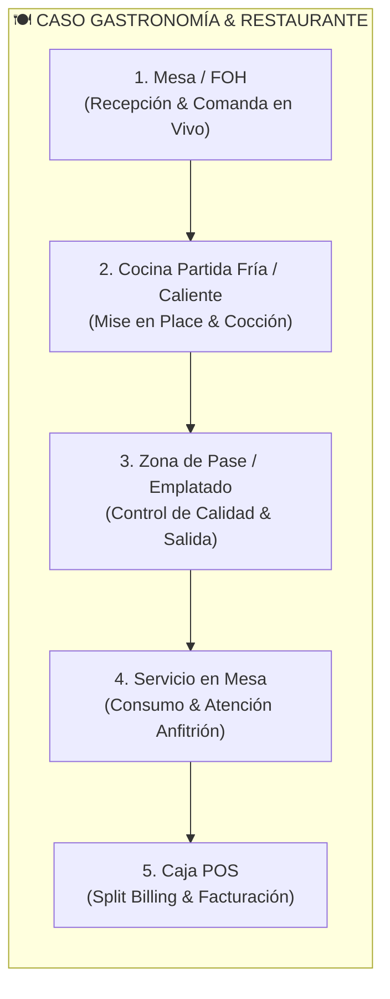
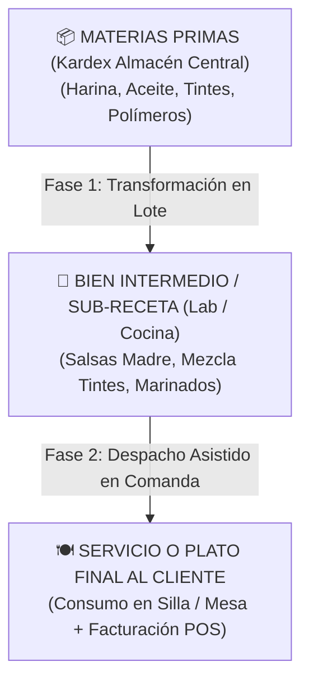
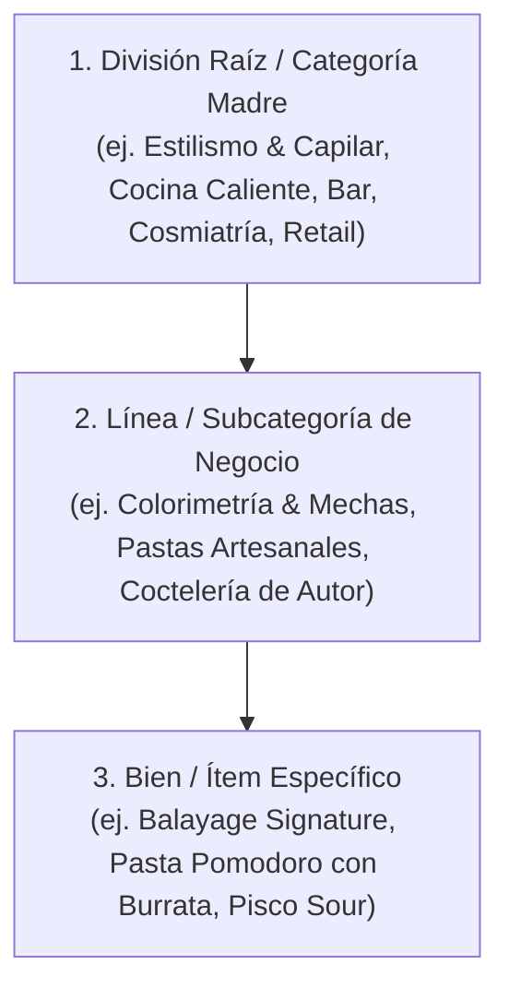

# 🏛️ Vaikuntha ERP: Filosofía Comercial, Estaciones por Etapas & Gobernanza Agnóstica

> *"Vaikuntha ERP está diseñado bajo un principio fundamental: **reducir la fricción operativa en tareas con demanda variable**, mientras otorga **control, trazabilidad y gobernanza quirúrgica** al dueño o administrador para moldear su portafolio de bienes, calibrar la rentabilidad por línea y coordinar la cadena de valor física y virtual de su negocio."*

---

## 🎯 1. Pitch Comercial B2B: Cómo Vender el Producto sin Marear al Comprador

Para presentar Vaikuntha ERP a un dueño de negocio, inversionista o gerente sin abrumarlo con tecnicismos, la narrativa se estructura en **3 capas intuitivas**:

```
                  ┌─────────────────────────────────────────────────────────┐
                  │          🏛️ CAPA 1: ACTIVIDADES TRANSVERSALES           │
                  │   CRM & Front  •  Caja POS  •  WMS Stock  •  WFM Piso   │
                  └────────────────────────────┬────────────────────────────┘
                                               │
                  ┌────────────────────────────▼────────────────────────────┐
                  │          👑 CAPA 2: GOBERNANZA & DELEGACIÓN             │
                  │   SuperAdmin ➔ Admin ➔ Jefe Piso ➔ Soporte ➔ Staff     │
                  └────────────────────────────┬────────────────────────────┘
                                               │
                  ┌────────────────────────────▼────────────────────────────┐
                  │          📈 CAPA 3: ESCALABILIDAD MULTI-SEDE            │
                  │      Multi-Sede  •  Multi-Marca  •  Multi-RUC SUNAT     │
                  └─────────────────────────────────────────────────────────┘
```

### A. Capa 1: Cobertura de las 4 Áreas Universales
Todo negocio de servicios físicos o transformación (salones, barberías, clínicas, odontología, spas, coworking, restaurantes o talleres) realiza exactamente 4 actividades:
1. **Recepción & CRM**: Registro de clientes, citas, llegada y hospitalidad.
2. **Punto de Venta (POS & Finanzas)**: Emisión de boletas/facturas, formas de pago flexibles y arqueo ciego de caja.
3. **Logística & Almacén (WMS & Transformación)**: Control de productos terminados, insumos fraccionados por gramos/unidades y productos intermedios (sub-recetas).
4. **Talento & Estaciones (WFM)**: Asignación de colaboradores a estaciones y cálculo automático de comisiones.

### B. Capa 2: Gobernanza y la Ecuación Control-Delegación
El ERP resuelve el dilema del fundador: *"¿Cómo delego responsabilidades sin que me roben o baje la calidad?"*:
- **Control & Trazabilidad**: Cada movimiento de inventario, cambio de precio, descuento o venta queda auditado con autor y hora.
- **Delegación Quirúrgica**: El `ADMIN` puede habilitar o deshabilitar herramientas una por una al personal de `SOPORTE` desde la Matriz de Usuarios (`/admin/usuarios`), permitiendo que los colaboradores crezcan dentro de la empresa asumiendo más funciones sin riesgo.

### C. Capa 3: Crecimiento Multi-Sede y Portafolio Multi-Marca
El sistema está preparado para operar una sola sede o una cadena de franquicias con distintas razones sociales (Multi-RUC SUNAT) y diferentes marcas bajo un mismo tablero central.

---

## 🔄 2. La Filosofía del Bloque WORKSPACE: La Estación Virtual de Trabajo & Pipeline por Etapas

En la barra de navegación del ERP, la sección **WORKSPACE** no es una carpeta más de opciones; representa el núcleo operativo:

> **Definición de Workspace**: Es el espacio digital que reúne las actividades del equipo de soporte (Recepción, Caja, Taller/Cocina) en torno a una **Estación de Trabajo** para servir a un cliente.



### A. La Estación como Eslabón de un Proceso Fluyente (Pipeline Operativo)
Una estación no es un punto estático aislado, sino una etapa dedicada dentro de un flujo secuencial donde el colaborador cuenta con herramientas específicas para su tarea:





---

## 🧪 3. El Módulo de Laboratorio como Centro Universal de Transformación (Cocina, Lab Químico o Taller de Preparación)

El **Módulo de Laboratorio / Despacho ODI (`/lab/despacho`)** es el motor de transformación y fraccionamiento del negocio. 

### A. Productos a Medio Terminar / Sub-Recetas (Mise en Place)
Muchos negocios no solo despachan materias primas puras o productos finales enlatados; elaboran **Bienes Intermedios** para que el servicio final sea ultrarrápido:

| Industria | Insumo Base (Materia Prima) | Bien Intermedio / Sub-Receta (Mise en Place) | Producto / Servicio Final Despachado |
| :--- | :--- | :--- | :--- |
| **💇 Salón de Belleza** | Tubo de Tinte 60g + Galonera Oxidante 20V | Bol de Mezcla de Coloración Balayage (120g) | Servicio de Balayage Signature en Silla |
| **🍽️ Restaurante** | Tomates, Cebollas, Ajos, Aceite de Oliva | Salsa Pomodoro Madre (Lote 5 kg en frío) | Plato de Pasta Fresca al Pomodoro en Mesa |
| **🥩 Restaurante Carnes** | Lomo Fino entero, Sal marina, Especias | Cortes porcionados y marinados (Cortes 300g) | Bife Angosto a la Parrilla en Mesa |
| **🍸 Bar & Coctelería** | Pisco Quebranta, Limón, Jarabe de goma | Mix Sour Base pre-elaborado (Lote 2L) | Cóctel Pisco Sour Clásico servido en barra |
| **🦷 Clínica Dental** | Polímero en polvo + Líquido monómero | Mezcla de Acrílico Dental Temporal | Corona Provisoria colocada al paciente |



- **Kardex en Dos Tiempos**:
  1. **Fase 1 (Producción del Lote Intermedio)**: Se descuentan materias primas primarias del almacén general y se da de alta stock en gramos/porciones del bien intermedio.
  2. **Fase 2 (Consumo por Comanda/OATC)**: Al solicitarse el plato o servicio, la balanza IoT o la comanda digital descuenta la porción exacta del bien intermedio en segundos.

---

## ⚖️ 4. La Dinámica FOH (Front of House) vs BOH (Back of House)

Vaikuntha ERP modela a la perfección la tensión y coordinación entre el frente y la retaguardia del negocio:

| Dimensión | 👥 Front of House (FOH) | 🍳 Back of House (BOH) / Laboratorio |
| :--- | :--- | :--- |
| **Ubicación Física** | Sala de Atención, Sillones, Mesas, Barra de Bar. | Cocina, Laboratorio de Tintes, Taller Químico, Sala de Esterilización. |
| **Perfil de Rol** | **`SOPORTE`** (Anfitriones, Meseros, Recepción). | **`STAFF / TÉCNICO`** (Cocineros, Chefs, Coloristas, Farmacéuticos). |
| **Contacto con Cliente** | **Directo y Permanente**. Hospitalidad, empatía, ritmo y resolución. | **Indirecto / Cero Contacto**. Enfoque total en el producto y receta. |
| **Naturaleza de Tareas** | Tareas cortas, ágiles, alta rotación, atención a pedidos y cobros. | Tareas de precisión, tiempos de cocción/mezcla, pesaje exacto y estandarización. |
| **Objetivo / Métrica Clave** | **Velocidad de respuesta, rotación de silla/mesa y ticket promedio**. | **Precisión en gramajes, tiempo de entrega de comanda y Cero Merma (Zero Waste)**. |
| **Herramienta ERP** | Tótem Kiosko, Monitor de Recepción, App Móvil FOH y POS. | Despacho ODI (`/lab/despacho`), Balanzas IoT y KDS (Kitchen Display System). |

---

## 📦 5. El Catálogo Jerárquico de Bienes (3 Niveles) & Rentabilidad

El portafolio se estructura en un **Árbol de 3 Niveles** que unifica servicios, productos terminados e insumos intermedios con trazabilidad financiera:



### Cálculo Automático de Rentabilidad por Ítem:
$$\text{Margen Bruto} = \text{Precio Venta} - \text{Costo Insumos / Sub-recetas} - \left(\text{Precio Venta} \times \frac{\text{Comisión \%}}{100}\right)$$
$$\text{\% Margen} = \left(\frac{\text{Margen Bruto}}{\text{Precio Venta}}\right) \times 100$$

---

## 👥 6. Matriz de Habilidades del Staff (Herencia + Override Granular)

En lugar de listas rígidas de un solo oficio, Vaikuntha ERP implementa un modelo híbrido:
1. **Herencia por Línea**: Asignar a un colaborador una línea de negocio lo habilita automáticamente para todos los servicios de esa categoría.
2. **Override Granular (Inclusiones / Exclusiones)**: El administrador puede excluir preparaciones complejas para aprendices o incluir preparaciones cruzadas.
3. **Reflejo en Piso y Móvil**: En la Cola en Vivo ([`TabCola.tsx`](file:///C:/Users/Admin/.gemini/antigravity/scratch/ERP-Supabase-VERCEL-Gonzales/src/components/mobile/TabCola.tsx)), el colaborador figura dinámicamente en todas las ramas donde posee destreza.

---

## 🔔 7. Autogestión de Demanda de Cartera, Alertas Web Audio & Leads CRM

Cuando un cliente llega solicitando a su profesional preferido (`Demanda: Cliente`) y dicho colaborador ya se encuentra ocupado:
1. **Alerta Háptica + Tono Web Audio**: El teléfono del especialista emite un acorde armónico (`reproducirChimeNuevaOrden`) y vibra de forma pulsante.
2. **Modal de Autogestión**: El profesional puede solicitar esperar al cliente, agendar una cita próxima o, si el cliente no puede esperar, generar automáticamente un **Lead de Recuperación CRM** en `public.crm_leads`.
