# 🏛️ Vaikuntha ERP — Obsidian Knowledge Vault & Central Documentation

Bienvenido al **Vault Central de Conocimiento y Arquitectura de Vaikuntha ERP**. Este repositorio de documentación viva está diseñado para ser abierto y explorado directamente en **Obsidian** (o cualquier visor Markdown compatible con enlaces `[[wikilinks]]` y diagramas **Mermaid**).

---

## 🗺️ Mapa de Contenido (MOC - Map of Content)

```mermaid
graph TD
    VAULT((🏛️ Obsidian Vault))
    VAULT --> M1["[[01_ARQUITECTURA_Y_BASE_DE_DATOS]]<br>• Esquemas Supabase<br>• Diagramas ERD<br>• RLS & Realtime<br>• Taxonomía de Estados"]
    VAULT --> M2["[[02_MANUAL_DE_FUNCIONAMIENTO_POR_ROLES]]<br>• Superadmin & Dev<br>• Recepción & CRM<br>• Caja & POS Flexible<br>• Staff Móvil & Totem<br>• Clientes VIP"]
    VAULT --> M3["[[03_FEATURES_UNICAS_Y_WHITE_LABEL]]<br>• Vaikuntha Points (VP 💎)<br>• Totem Kiosko Dual 2.0<br>• Lab de Tintes en Gramos<br>• Insignias Dinámicas<br>• Auto-Sanación de Estado"]
    VAULT --> M4["[[04_LANDING_PAGES_COPYWRITING_Y_ESTRUCTURA]]<br>• Landing 1: Vaikuntha ERP Suite<br>• Landing 2: LuminaHQ AI Suite<br>• Landing 3: Virtual Inmersive Hub<br>• Estrategia Sandbox & Demo"]
    VAULT --> M5["[[05_WORKSPACE_VENTA_SUNAT_PSE]]<br>• POS Todo-en-Uno<br>• Split Billing & Retail<br>• Facturación Nubefact PSE<br>• Driver Térmico 58mm/80mm<br>• Cuentas por Cobrar"]
    VAULT --> M6["[[06_WORKSPACE_TALLER_IOT_WMS]]<br>• Despacho de Insumos (ODI)<br>• Fórmulas Dinámicas<br>• Balanzas IoT (BLE/WiFi/Serial)<br>• Kardex en Gramos"]
    VAULT --> M7["[[07_WFM_ASISTENCIA_REGIMEN_LABORAL]]<br>• Control Asistencia NFC/Kiosko<br>• Reset Nocturno de Disponibilidad<br>• RHE (4ta Cat) vs Planilla (5ta)<br>• Conciliación Inteligente"]
    VAULT --> M8["[[08_GOOGLE_JULES_AUTOMATION]]<br>• Google Jules CLI<br>• Estrategia Híbrida 90/10<br>• Scripts de Despacho Cloud<br>• AGENTS.md Protocol"]
```

---

## 📚 Módulos de Documentación

| Archivo | Propósito | Enlace de Navegación |
| :--- | :--- | :--- |
| **01. Arquitectura & Base de Datos** | Modelado relacional completo en PostgreSQL/Supabase, políticas de seguridad RLS, flujos transaccionales y taxonomía estricta de estados (`estado` vs `estado_operativo`). | [[01_ARQUITECTURA_Y_BASE_DE_DATOS]] |
| **02. Manual de Funcionamiento por Roles** | Guía operativa paso a paso para los perfiles del ecosistema: Superadmin, Recepción, Workspace Venta, Workspace Taller, Staff y Kiosko. | [[02_MANUAL_DE_FUNCIONAMIENTO_POR_ROLES]] |
| **03. Features Únicas & White-Label** | Documentación de los diferenciadores competitivos: fidelización multi-tenant, terminales táctiles duales, calibración IoT y segmentación en vivo. | [[03_FEATURES_UNICAS_Y_WHITE_LABEL]] |
| **04. Landing Pages & Copywriting** | Especificación técnica, estructura de componentes y textos persuasivos para las 3 landing pages de lanzamiento antes del deploy en producción. | [[04_LANDING_PAGES_COPYWRITING_Y_ESTRUCTURA]] |
| **05. Workspace Venta & SUNAT PSE** | Punto de venta todo-en-uno, split billing, retail de vitrina, facturación electrónica homologada SUNAT PSE / Nubefact, driver térmico y créditos. | [[05_WORKSPACE_VENTA_SUNAT_PSE]] |
| **06. Workspace Taller, IoT & WMS** | Despacho de insumos por fórmulas dinámicas, pesaje con balanzas IoT (BLE/WiFi/Serial), merma técnica y kardex de inventario en gramos. | [[06_WORKSPACE_TALLER_IOT_WMS]] |
| **07. WFM, Asistencia & Régimen Laboral** | Gestión de asistencia biométrica/NFC, reset nocturno de disponibilidad de staff, configuración de RHE (4ta) vs Planilla (5ta) y conciliación de horas. | [[07_WFM_ASISTENCIA_REGIMEN_LABORAL]] |
| **08. Google Jules Automation** | Integración del CLI `@google/jules` con Antigravity bajo la estrategia 90/10 para suites de testing y tareas pesadas en background cloud. | [[08_GOOGLE_JULES_AUTOMATION]] |

---

## ⚡ Stack Tecnológico

- **Frontend & App Framework**: Next.js (App Router), React, TypeScript, Tailwind CSS, Lucide Icons, Zustand.
- **Backend & Base de Datos**: Supabase (PostgreSQL 15), Supabase Realtime Channels, Row Level Security (RLS).
- **Facturación Electrónica**: Proveedor de Servicios Electrónicos (PSE/OSE) SUNAT / Nubefact API.
- **Hardware & Periféricos**: Web NFC API (Android), Impresión Térmica ESC/POS (58mm/80mm), Balanzas Digitales IoT (BLE, WiFi, Serial USB), Audio Chimes & Haptic API.
- **AI & Automatización**: Google Jules Cloud CLI, Antigravity 2.0 Agentic Framework.
- **Despliegue & DevOps**: Vercel (Producción & Staging), Next.js Edge Runtime.
